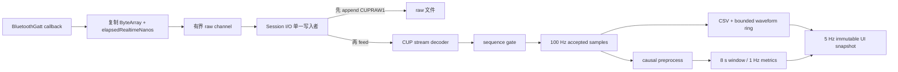

# PPGCollector Android 总移植方案

版本：1.1（规划与 agent 执行基线）  
日期：2026-08-01  
目标：在 Android Studio 中实现一个与当前 iOS PPGCollector 数据行为兼容、适合 Android 生命周期和后台规则的新 app。

本文件负责详细的产品/技术规划；每轮开始、恢复或上下文压缩时，agent 先阅读 [Codex Agent 移植入口](../00_AGENT_MIGRATION_BRIEF.md)，再阅读[简版开发状态](../status/DEVELOPMENT_STATUS.md)。当前 Android 工程事实和每轮完成记录不写在本文件中，以免把规划目标误读为已实现能力。

## 1. 结论

本项目不是把 SwiftUI 逐行翻译为 Kotlin，而是保留四类跨平台契约，并重写平台壳层：

1. **必须逐语义保持**：CUP BLE profile、408 字节批帧、碎片流解码、序号判断、100 Hz RED/IR 样本顺序、`CUPRAW1`、CSV/session JSON、版本字段、恢复策略、HR/SQI 数值行为。
2. **必须按 Android 重写**：权限、扫描与 GATT 回调、前台服务、后台限制、生命周期、Compose UI、内部存储/SAF/FileProvider。
3. **先保留“不可用”**：SpO2、BP。现有 ratio-of-ratios 只是诊断值，没有校准曲线；不得显示成临床结果。
4. **后续增强**：Python GUI 中的稳定段分析、平均周期、光谱、双会话对比和专家工作台。它们应建立在同一 raw replay 管线之上，不应复制一套解码器。

推荐 V1 先交付“连接 + 实时波形/指标 + 可靠录制 + 保存会话 + 校验/重放/导出”；V1.1 再交付完整离线工作台；专家诊断作为 V2。这样最早就建立不可逆的数据契约，同时把 UI 扩张与底层可靠性解耦。

## 2. 来源、边界与冲突处理

### 2.1 已使用来源

- 原始产品需求：[测试软件需求V1.0.docx](../reference_sources/product_requirements/测试软件需求V1.0.docx)、[界面示意](../reference_sources/product_requirements/requirement_mockup.png)、[协议示意](../reference_sources/product_requirements/protocol_frame_requirement.jpg) 与 [SQI 参考脚本](../reference_sources/product_requirements/sqi_template_match.py)。
- 当前 iOS app：归档在 [ios_current/PPGCollector](../reference_sources/ios_current/PPGCollector/)；它是现有行为、数据格式、边界条件的主要基线。
- 当前 iOS 测试：归档在 [ios_current/PPGCollectorTests](../reference_sources/ios_current/PPGCollectorTests/)；它们转化为 Kotlin/JVM、instrumented 和真机长稳门禁。
- Python GUI：归档在 [python_gui](../reference_sources/python_gui/)；只参考算法、会话处理、离线分析和工作台交互。
- 协议与算法金标：[protocol](../reference_sources/protocol/) 与 [signal_fixtures](../reference_sources/signal_fixtures/)。

排除项见 [EXCLUSIONS.md](../manifests/EXCLUSIONS.md)。隔壁 Swift 工程及其迁移说明未被使用。

### 2.2 证据冲突规则

发生冲突时，先建一个短 ADR，按以下优先级裁决：原始需求/真机固件 > 当前 Swift 可执行行为与测试 > Python 算法/UX > 规划建议。两个已知语义必须在 Android 中显式化：

- SQI 内部统一为 `0.0...1.0`，UI 可格式化成百分比；无效或未热身时写 `0` 且 `valid=false`，不能让 `0` 看起来像有效差质量。
- 需求中“sqi、soft_version、alg_version 三个字段”按三个字段落实；`sqi` 是测量值，后两者在录制开始时固化为版本元数据。

## 3. 产品范围

### 3.1 Android V1

- 扫描名称以 `CUP` 开头的设备，展示名称、地址别名、RSSI，支持停止扫描、连接、断开和重试。
- 按 CUP GATT profile 订阅通知；展示阶段、超时、流新鲜度、字节/帧/样本/缺帧/丢弃字节等诊断。
- 实时显示 RED/IR 原始双波形，窗口 8 秒，独立动态 Y 轴；默认 5 Hz 发布 UI 快照，配置允许 1–60 Hz。
- 每秒更新 HR、SQI 和 R（ratio-of-ratios）诊断；显示有效、预热、陈旧、不可用、临时值等状态，而不只显示数值。R 不是呼吸率。
- 文件名仅允许 ASCII 字母、数字、`_`、`-`；空白、重名和录制中改名均禁止。
- 满足“已连接 + 流新鲜 + 名称有效 + 存储预检通过”后才允许开始。
- 录制原始通知块、逐样本 CSV 和 session JSON；安全处理用户停止、断连、超时、服务销毁、写入错误和崩溃后恢复。
- 会话列表、详情、完整性检查、raw 重放、导出与恢复。
- Android 特有：录制期间使用 `connectedDevice` 类型前台服务；从可见页面启动，常驻通知提供状态和停止入口。

### 3.2 Android V1.1

- 版本化、不可覆盖的离线再分析结果；进度、取消、历史和对比。
- 稳定段/窗口判定、RED/IR 通道选择、平均周期和置信区间、频谱、周期叠加。
- CSV/JSON/原始文件通过系统文件创建器导出；分享使用 `content://`，不暴露绝对路径。

### 3.3 V2/延后

- 完整专家诊断工作台和多会话统一周期对比。
- IMU、SpO2、BP、医疗结论、云同步、账户、远程固件控制。
- 只有在得到设备数据契约、算法模型、校准版本和金标后，才能把上述测量从“不可用”升级。

## 4. Android 技术基线

### 4.1 SDK 与设备范围

- 当前工程实际 `compileSdk = 37`、`targetSdk = 37`，与 `app/build.gradle.kts` 对齐；发布前仍需按官方政策和目标设备清单复核。
- `minSdk = 26` 覆盖 Android 8.0 及以上；当前工程已采用此值，但仍需 Phase 0 用目标设备清单确认是否最终保留。
- API 26、30、31、33、34、35、36、37 是必测边界；有更高预览/正式 API 时做前向兼容测试。Android 17 当前资料见[官方页面](https://developer.android.com/about/versions/17)。
- 采用 Kotlin、Gradle Kotlin DSL、Jetpack Compose、Material 3、Coroutines/Flow、kotlinx.serialization。依赖版本在建工程当日以稳定版 version catalog 锁定，不在规划文档中写死易过期版本。

### 4.2 建议模块

```text
:app                         Compose 壳、导航、权限、DI、前台服务入口
:core:model                  跨平台模型、版本、状态机、错误
:core:protocol               CUP 帧、流解码、序号与诊断（纯 Kotlin）
:core:signal                 预处理、peak、HR、SQI、ratio（纯 Kotlin）
:data:ble                    Scanner/GATT/超时/新鲜度/通知块流
:data:session                raw/CSV/metadata、仓库、检查、恢复、导出
:feature:devices             扫描、连接和实时监视
:feature:capture             录制控制与状态 UI
:feature:sessions            历史、详情、重放、恢复、导出、再分析
:feature:diagnostics         V1.1/V2 工作台
:benchmark                   宏基准、长稳/性能工具（可不随 release 打包）
```

依赖方向只允许 feature/data → core；`core:protocol` 和 `core:signal` 不能依赖 Android SDK，确保绝大多数对等测试在 JVM 上快速执行。采用官方推荐的分层、单向数据流、screen-level ViewModel、StateFlow 和生命周期感知采集，参考 [Android 架构指南](https://developer.android.com/topic/architecture) 与[架构建议](https://developer.android.com/topic/architecture/recommendations)。

## 5. 核心运行链路



必须保持以下不变量：

- GATT 回调不做磁盘 I/O、DFT 或 Compose 状态更新，只复制数据、记单调时钟并尝试送入有界 channel。
- 录制时，**原始通知块写入成功后**才解码和追加 CSV；原始文件是恢复与再分析真源。
- raw channel 建议容量 256，不能采用会静默 `DROP_OLDEST` 的流。容量溢出必须增加诊断并安全结束录制为 incomplete；静默丢 raw 不可接受。
- 协议缓冲、最近样本、波形、分析窗口、写入队列全部有上限。当前窗口基线 800 样本。
- UI 只能读不可变快照，不能拥有 BLE/GATT、写入器或可变 ring buffer。
- 每条事件携带 `connectionGeneration/sessionId`；旧连接、旧分析任务或旧 callback 不得污染新状态。

## 6. BLE 与生命周期策略

Android 12/API 31 以上在运行时请求 `BLUETOOTH_SCAN` 与 `BLUETOOTH_CONNECT`；API 30 以下按实际是否推导位置处理 legacy 权限。清单和运行时分支见[官方 BLE 权限说明](https://developer.android.com/develop/connectivity/bluetooth/bt-permissions)。

连接状态机保持与 iOS 等价：

```text
idle → scanning → connecting → discoveringServices
     → discoveringCharacteristics → enablingNotifications
     → subscribed → receiving
任意阶段 → disconnecting → idle
任意阶段 → failed(reason)
```

- 使用 `BluetoothLeScanner`，扫描结果进入 app 后按名称 `CUP` 前缀筛选；连接使用 `autoConnect=false`。
- 严格匹配 NUS UUID：service `6E400001-...`、notify `6E400003-...`、control `6E400002-...`。当前设备是被动流，V1 不发送控制命令。
- 每一步单独超时，建议先复刻 iOS 的 connect 12 s、service 8 s、characteristic 8 s、subscribe 8 s；超时只对当前 generation 生效。
- 正确写 CCCD 并等待回调后才进入 subscribed；通知到达时记录 `SystemClock.elapsedRealtimeNanos()`。请求 MTU 可以作为优化，但解码绝不能依赖通知边界或特定 MTU。
- 最后有效样本超过 2 s 进入 stale，停止中的录制；扫描、连接、订阅、流新鲜度分别展示，避免一个模糊的“已连接”。

Android 允许在保持 GATT 连接时接收通知，但长时监听/录制需要合适的后台策略；官方建议根据场景使用前台服务或 Companion Device API，见[后台 BLE 指南](https://developer.android.com/develop/connectivity/bluetooth/ble/background)。本项目建议：

- 非录制预览只在页面可见和进程前台时保持；进入后台停止预览/扫描，可由用户回来后重连。
- 开始录制时，界面向 `CaptureForegroundService` 移交唯一会话所有权。服务类型为 `connectedDevice`，声明对应前台服务权限，并满足 BLE runtime permission 前置条件，参见[前台服务类型](https://developer.android.com/develop/background-work/services/fgs/service-types)。
- 服务必须在 app 可见时通过 `startForegroundService` 启动并及时 `startForeground`；API 31+ 的后台启动限制见[启动规则](https://developer.android.com/develop/background-work/services/fgs/launch)。
- 通知显示设备、时长、流/写入状态并提供“停止并保存”；Activity 重建只重新绑定状态，不创建第二个 GATT 或 writer。
- 被系统或用户停止服务时走统一 finalizer；不可完整落盘时保留 raw 可恢复前缀和 incomplete metadata。

## 7. 数据、算法与 UI 迁移原则

### 7.1 协议与文件

- 当前 Swift/金标中的 CUP V1 帧固定 408 字节：`AB BA`、function `0x15`、payload length、8-bit sequence、50 组 little-endian `UInt32 RED + UInt32 IR`、`CD DC`；100 Hz、每帧 50 样本。原始协议截图中同时出现疑似“32 个红光采样点”和“一共 50 组”的矛盾文字，因此 50 组只能作为现行实现基线，Phase 0 必须用真实固件抓包确认后才能冻结 production profile。
- decoder 接受任意碎片/粘包并能重新同步。首帧接受；连续帧接受；缺帧后的新帧接受且计 gap；duplicate/out-of-order 拒绝进入样本流。
- `CUPRAW1\0` 后重复 `<UInt64 little-endian hostNs><UInt32 little-endian length><raw bytes>`。保留通知原始分块，不把重组帧伪装成通知块。
- CSV 列顺序、空值、有效标记与版本字段必须兼容 iOS；session JSON 保持 snake_case。Android 可增加 additive 字段，但旧 reader 必须忽略未知字段。
- 文件系统是会话真源；数据库如 Room 只做可重建索引。内部 app-specific storage 不需存储权限，但卸载会删除，见[官方说明](https://developer.android.com/training/data-storage/app-specific)。导出使用 SAF `ACTION_CREATE_DOCUMENT`，[官方说明](https://developer.android.com/training/data-storage/shared/documents-files)；分享使用 [FileProvider](https://developer.android.com/reference/androidx/core/content/FileProvider)。

### 7.2 算法

- 先将当前 Swift 纯函数等价移植为 Kotlin `DoubleArray`；再用 Python fixture 验证，而不是把 Python GUI 运行时嵌进 app。
- 因果预处理保持 100 Hz、Butterworth 3 阶 0.6–4 Hz 的固定 SOS 系数、DC 跟踪、gap reset、IR 极性和 z-score 语义。
- HR 保持 4–8 s 条件、边缘裁剪、MAD scale、Hann/DFT、双极性、SciPy-compatible peak/prominence/width/distance、RR 连续段、谱峰一致度与置信阈值。
- SQI 保持峰分割、等长周期、均值模板、Pearson、`dropLast` 以及 0.9/0.7 分级；内部 `0...1`。
- live runtime 使用 800 样本窗口、100 样本步长；gap 使窗口 generation 失效并重新预热。重任务在 Default dispatcher；新窗口可取消旧计算，但完成结果必须检查 generation 和 window end index。
- Python `segmented_pulse.py` 的稳定段/聚类是 V1.1 离线能力，不能替换 V1 live 算法而不提升 algorithm version。

### 7.3 Compose UI

- 页面：设备/实时 → 录制 → 会话列表 → 会话详情 → 分析历史/对比 → 专家诊断。
- 波形用 Compose `Canvas`，RED/IR 分上下轨、各自动态 Y。先做 min/max bucket 再绘制，避免在高缩放或长重放时把每点变成 UI 对象。
- 默认实时视窗 8 s；每条轨道对当前窗口计算范围，忽略起始过渡并加约 8% padding。横向缩放/平移只用于重放，实时页保持尾随。
- ViewModel 暴露单一 `UiState`；用 `collectAsStateWithLifecycle`。Composable 退出只影响 UI 订阅，不应意外销毁由前台服务持有的录制。
- 产品如要求“页面退出即停止”应作为 `RecordingBackgroundPolicy.StopOnNavigation` 明确配置；推荐 Android 默认是录制继续、通知可停止，并在离开页面前给清晰状态，而不是受重组/Activity 重建影响。

## 8. 迁移顺序

1. **Phase 0 契约冻结**：真机确认 UUID/帧/频率、版本、设备矩阵、后台策略；建立 Android repo/CI/ADR。
2. **Phase 1 纯 Kotlin 内核**：协议、序号、raw reader/writer、预处理、peak、HR、SQI；全部 golden tests 先绿。
3. **Phase 2 BLE 垂直切片**：权限、扫描、连接、订阅、通知、超时、新鲜度、诊断；真机连续连接和碎片测试。
4. **Phase 3 可靠录制**：前台服务、raw-first、CSV/metadata、统一停止、低存储、崩溃恢复、导出。
5. **Phase 4 V1 UI**：实时双波形、指标、录制、历史、详情、重放与检查。
6. **Phase 5 离线分析**：版本化分析、稳定段、光谱、平均周期、对比。
7. **Phase 6 硬化发布**：30 min/2 h、权限/API/厂商矩阵、功耗/内存、可访问性、隐私、签名与 Play 内测。

详细任务、估算和门禁见[实施路线与验收](04_IMPLEMENTATION_ROADMAP_AND_ACCEPTANCE.md)。

## 9. 最终 Definition of Done

V1 只有同时满足以下条件才算移植完成：

- 同一个 golden frame 在 Python、Swift、Kotlin 中得到完全相同的 sequence/RED/IR；任意分片、噪声、缺帧、重复和乱序测试通过。
- Android 生成的 raw/CSV/session 可被兼容审计工具读取；raw 重放出的样本、计数和 CSV 对齐。
- 预处理、HR、SQI fixtures 按既有严容差通过；算法/预处理/profile/version 记录完整。
- 20 次扫描连接订阅循环无旧 callback 污染；拔电、蓝牙关闭、权限撤销、断连、2 s 无数据均有确定状态和安全停止。
- 30 分钟模拟流和 2 小时录制门禁通过：最近样本保持 800、decoder 尾为空、无缺帧/丢弃、CSV 行数精确、流式 reader 峰值 buffer 有上限。
- API 26/30/31/33/34/35/36/37 的权限、通知、前台服务和导出流程通过；至少覆盖一台 Pixel/原生系和一台目标厂商真机。
- 旋转、Activity 重建、页面切换、进后台、系统回收、服务停止、磁盘不足和进程崩溃不会产生两个 writer，不覆盖已有会话，并能识别/恢复合法前缀。
- 发布包不包含 Python runtime、测试原始个人数据或调试日志中的设备隐私信息。

## 10. 开工前硬性确认

下列问题未确认前可以做 Phase 1，但不能冻结发布行为：真实设备 GATT/固件版本、`minSdk` 和目标机型、Android 录制是否允许后台继续、包名/签名/分发渠道、保留/导出/加密政策、soft/alg version 的正式命名、SpO2/BP 的产品表述。完整清单见[决策与风险登记](06_OPEN_DECISIONS_AND_RISK_REGISTER.md)。
