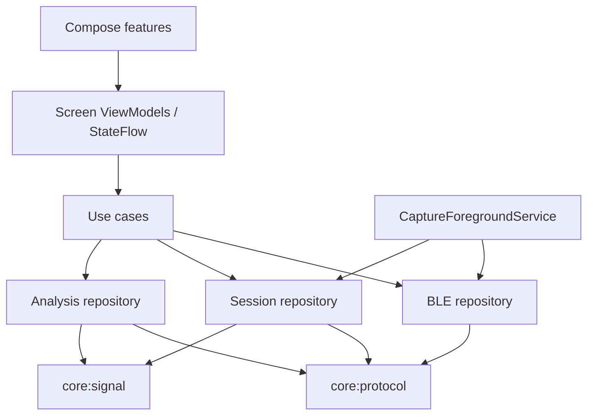
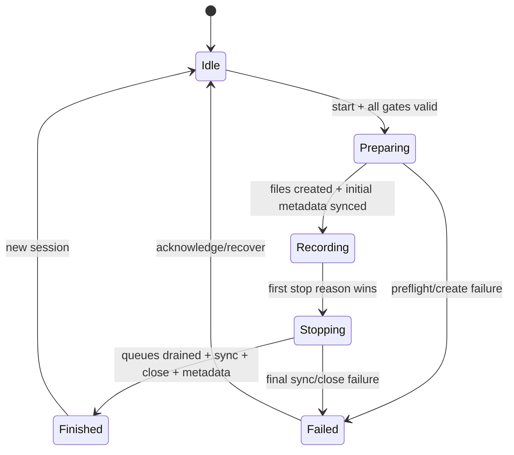

# Android 架构与数据契约

本文件规定实现边界和不可破坏的契约。未决的产品选择放在[风险与决策登记](06_OPEN_DECISIONS_AND_RISK_REGISTER.md)，不得由某个 Composable 或 callback 临时决定。

## 1. 分层与所有权



所有权规则：

- `BleConnectionManager` 是某一 connection generation 的唯一 `BluetoothGatt` 所有者。
- 非录制实时预览由 app-scope coordinator 所有；一旦开始录制，会话控制、GATT 和 writer 原子移交/绑定到 `CaptureForegroundService`。Activity 只观察。
- `SessionWriter` 是每个 session 的唯一文件写入者，内部单线程/actor 化；没有第二个 repository 可以直接 append。
- `CUPStreamDecoder`、`SequenceTracker`、`LiveMetricRuntime` 都是每连接/会话实例，断连或 gap 按契约重置；不得做全局单例。
- 文件系统是会话真源。若用 Room，表中只存可重建摘要、搜索和最近检查状态，不存唯一原始样本。

建议依赖注入可用 Hilt，但核心模块的构造函数保持普通 Kotlin 注入，以便 JVM test 不启动 Android 容器。

## 2. 关键接口草案

名称可调整，但语义必须保持：

```kotlin
data class RawNotificationChunk(
    val connectionGeneration: Long,
    val hostMonotonicNanos: Long,
    val bytes: ByteArray,
)

interface CupBleClient {
    val state: StateFlow<BleState>
    val diagnostics: StateFlow<BleDiagnostics>
    val rawChunks: Flow<RawNotificationChunk>
    suspend fun scan(): Flow<DiscoveredCupDevice>
    suspend fun connect(deviceId: String)
    suspend fun disconnect(reason: DisconnectReason)
}

interface SessionWriter {
    suspend fun appendRawThenDerive(chunk: RawNotificationChunk): AppendResult
    suspend fun finish(reason: CaptureStopReason): SessionSummary
}

interface RawReplayEngine {
    suspend fun replay(path: Path, consumer: suspend (ReplayEvent) -> Unit): ReplayReport
}
```

Android `Path` 可在 data 层替换为 `File`/Okio Path；core 层不要泄漏 `Context`、`Uri`、`BluetoothGatt` 或 Compose 类型。

## 3. BLE 详细设计

### 3.1 权限与入口

清单建议按 SDK 分段：

| API | 清单/运行时 | 说明 |
|---|---|---|
| 26–30 | legacy `BLUETOOTH`/`ADMIN`；扫描通常需要 `ACCESS_FINE_LOCATION` | `maxSdkVersion=30`，结合产品是否从扫描推导位置作合规说明 |
| 31+ | `BLUETOOTH_SCAN`、`BLUETOOTH_CONNECT` | Nearby devices runtime group；如声明 `neverForLocation`，必须确认不会过滤 CUP 广播 |
| 33+ | `POST_NOTIFICATIONS` | 建议申请以保证录制状态可见；拒绝时 app 仍需解释前台服务可见性限制 |
| 34+ | `FOREGROUND_SERVICE`、`FOREGROUND_SERVICE_CONNECTED_DEVICE` 和 service type | 启动时已有 `BLUETOOTH_CONNECT`/`SCAN` 等前置条件 |

权限依据见[官方 Bluetooth permissions](https://developer.android.com/develop/connectivity/bluetooth/bt-permissions)和[前台服务类型](https://developer.android.com/develop/background-work/services/fgs/service-types)。不要在 ViewModel 构造时弹权限；UI 事件发起，ViewModel 只接收结果。

### 3.2 GATT 状态机

每次连接生成递增 `generation`。所有 callback 首先核对 `BluetoothGatt` identity、设备 ID、generation 和期望阶段。建议事件循环串行处理：

```text
ConnectRequested
  → onConnectionStateChange(CONNECTED)
  → discoverServices()
  → onServicesDiscovered + exact supported service/profile
  → exact notify/control characteristic from selected profile
  → setCharacteristicNotification(true)
  → write CCCD ENABLE_NOTIFICATION_VALUE
  → onDescriptorWrite(success)
  → subscribed
  → first accepted sample → receiving/fresh
```

Android 不保证 callback 线程固定；callback 中复制 `characteristic.value`/新 API 参数，立即 `trySend` 到串行事件 channel。重复 callback、`GATT 133`、bonding、蓝牙关闭和 `onServiceChanged` 均转换为 typed error；关闭顺序是 cancel deadline → disable/cancel collection → `disconnect()` → `close()` → generation++。

支持的 CUP transport profile 是有序 registry：既有 NUS `6E400001/3/2-...` 和新硬件 `FFF0/FFF1/FFF2`。扫描阶段的 `CUP` 名称前缀不能证明协议；必须等服务发现后按 service UUID 选择 profile，再只发现该组特征。选中的 profile、发现的 service/characteristic 要进入诊断快照，录制开始时将实际 profile 固化到 session。若设备同时暴露多组，registry 顺序决定优先级；若一组都没有则失败并报告期望/实际 UUID。

建议 deadline 初值与 iOS 相同：连接 12 s；发现 service、characteristic、订阅各 8 s。它们应来自 profile/config，使用虚拟时钟测试，不散落 magic number。

### 3.3 数据背压

BLE callback 到 session actor 之间使用有界 `Channel<RawNotificationChunk>(256)`。选择原则：

- `trySend` 失败时累加 `queueOverflowCount`，立即发出资源故障；录制 finalizer 将会话标 incomplete。
- 非录制预览允许停止/重连，而不是偷偷丢弃 raw 后继续声称 fresh。
- 不使用 `SharedFlow(extraBufferCapacity, DROP_OLDEST)` 承载唯一 raw 真源；可在派生 UI snapshot 上使用 conflation。
- 每个 chunk 的 `ByteArray` 不再由 BLE API 复用；测试应改变原 callback buffer 以证明已复制。

## 4. CUP 协议契约

### 4.1 字节布局

| Offset | 长度 | 字段 | 规则 |
|---:|---:|---|---|
| 0 | 2 | header | `AB BA` |
| 2 | 1 | function | `15` |
| 3 | 2 | data length | little-endian，当前为 `161`（sequence 1 + data 160） |
| 5 | 1 | sequence | UInt8，255 后回 0 |
| 6 | 80 | RED[0..19] | 20 个 UInt32 LE |
| 86 | 80 | IR[0..19] | 20 个 UInt32 LE |
| 166 | 2 | tail | `CD DC` |

当前说明没有 checksum。布局证据来自 2026-08-04 用户协议和 `testdevice1` 真实 FFF1 导出，详见 ADR-0003/0004；短时数据支持 168-byte/20 samples/约 100 Hz，但固件版本、characteristic properties、辅助/控制语义和长稳仍未确认，因此仍是 bring-up profile。历史 Swift/Python/C++ reference 的 408-byte、50-pair interleaved 布局不再用于当前接收编码，只用于既有 raw/session 兼容读取。单个 decoder/连接在首个合法帧后锁定布局，不能在同一流中静默混用两种 wire profile。

`testdevice1` 真实导出还确认 FFF1 会穿插完整 8-byte 辅助帧：offset 0～1 为 `AB BA`，2 为 function，3～5 为未解释 payload，6～7 为 `CD DC`；已观测 function 为 `0x02/0x06/0x0C/0x0F`。decoder 仅对这四种“精确 8-byte + 正确头尾”组合做 auxiliary 计数并消费，不输出 `CupBatchFrame`。payload 语义未知，不能映射为传感器结果或控制状态；其他 function、长度或坏尾继续进入 invalid/discard 诊断，见 ADR-0004。

### 4.2 流解码

推荐 `ByteRing`/有界可压缩 buffer；伪代码：

```text
append(chunk)
while enough bytes:
  find AB BA; account discarded prefix
  if less than fixed header: keep tail and return
  if observed 8-byte auxiliary function: wait for 8, validate tail, count and consume
  validate function and declared length
  if invalid: discard one byte, increment category, continue
  if less than calculated frame length: return
  validate tail
  if invalid: discard one byte, increment invalidTail, continue
  decode current 20 RED words + 20 IR words (or locked legacy layout)
  consume calculated frame length; emit frame
```

decoder 输出结构合法帧；sequence gate 决定是否进入 accepted stream。gap 计数为 `(current - previous - 1) mod 256` 的合理前向距离；duplicate 和明显反向/旧帧拒绝。移植时不要把 `ByteBuffer` 默认 big-endian 当成设备端序。

## 5. 捕获状态机与统一结束



`CaptureLifecycleGate` 用原子 compare-and-set/Mutex 保存第一个 stop reason。后来的断连或错误可以加入 diagnostics，但不能改变用户可审计的终止因果。finalizer 次序建议：

1. 标记 `accepting=false`，拒绝新 chunk；
2. 取消 metric/UI 派生任务；
3. drain 已接受的 raw queue；
4. raw/CSV flush + `FileDescriptor.sync()`；
5. close handles；
6. 原子写最终 metadata；
7. 更新通知/StateFlow；
8. 如无预览策略需要，关闭 GATT/停止 service。

finalizer 自身必须幂等，可由用户按钮、notification action、stale、disconnect、`onDestroy` 和异常路径同时调用。

## 6. 会话目录与文件格式

### 6.1 建议目录

```text
filesDir/PPGCollector/sessions/<base_name>/
├── <base_name>.cupraw
├── <base_name>.csv
├── <base_name>.session.json
└── analysis/
    └── <analysis_id>.json
```

在 Android 内部存储使用真实目录；导出时可打 zip 或分别通过 SAF 创建。不可直接把用户选择的 `DocumentFile` 当作高频 raw writer，除非测量并验证 provider 的一致性与 fsync 语义；优先先录到内部存储，再显式导出。

创建流程：校验名 → `StatFs` 预检（基线 20 MiB，加预计时长可动态提高）→ 确保目标不存在 → 建 staging/目录 → 创建三个文件 → 写 magic/header/initial incomplete metadata → sync → 进入 Recording。

### 6.2 Raw

```text
magic:  43 55 50 52 41 57 31 00   # "CUPRAW1\0"
record: uint64_le host_monotonic_ns
        uint32_le payload_length
        payload_length bytes copied from one BLE notification
```

- `payload_length` reader 上限建议 64 KiB，超出视为损坏；writer 可记录实际通知长度。
- monotonic time 只用于间隔/顺序，不能转成 UTC；session 的 started/ended UTC 单独记录。
- reader 流式读取，遇到不完整 header/payload 返回 `safePrefixBytes` 和 finding，不分配攻击者声明的巨型 buffer。

### 6.3 CSV

列顺序必须保持：

```text
schema_version,session_id,sample_index,device_time_s,
host_frame_time_ns,frame_sequence,sample_in_frame,red,ir,
heart_rate_bpm,heart_rate_valid,heart_rate_time_s,
spo2_percent,spo2_valid,spo2_time_s,
sqi,sqi_valid,sqi_time_s,
soft_version,alg_version,preprocess_profile,protocol_profile,
ratio_of_ratios,ratio_of_ratios_valid,ratio_of_ratios_time_s
```

`device_time_s = sample_index / 100.0`，从第一条 accepted sample 开始；frame host time 可在该帧全部样本复用。首个 8 s live 指标对应 window end index 799、时间 `7.99`。数字使用 `Locale.ROOT` 和固定格式，禁止设备地区把小数点写成逗号。字符串字段虽然当前受控，writer 仍实现 RFC 4180 转义。

CSV 中的指标列是 raw notification 写入时携带的 point-in-time snapshot，不是异步分析结果的回填目标：writer 已经确认的行不可被后续 HR/SQI/R 计算改写，metric 的 `*_time_s` 必须继续来自真实 `sourceSampleIndex`。录制中的分析结果通过 StateFlow/UI 观察；离线分析使用独立、版本化的结果文件，不能反向修改源 CSV。

### 6.4 Metadata

保留现有 snake_case 字段：schema/session/name/UTC、soft/alg/preprocess/protocol/transport、sample rate/frame size、device、complete/stop reason、frame/sample/raw chunk 与 sequence/invalid/discard 计数、writer、files、recovery。Kotlin 使用 kotlinx.serialization 自定义 ISO-8601 `Instant` 序列化，并测试与 Swift JSON 双向读取。

进行中至少每秒用临时文件 + fsync + atomic rename 更新 incomplete metadata；Android 可用 `AtomicFile`，但要验证 backup 清理和 crash 行为。最终 `complete=true` 只表示 writer 正常完成，不替代 inspection；UI 的 verified complete 需要 metadata、raw、CSV 三者一致。

### 6.5 检查与恢复

- inspection 不改源：hash、raw scan、同 production pipeline 重放、CSV streaming scan、metadata cross-check。
- recovery 不“修复”原目录：计算源 hash → 找 safe raw/CSV prefix → 复制到 staging → 写新 session ID/incomplete metadata 和 recovery provenance → sync → 原子移动到新且不重名目录。
- CSV 无完整换行的末行不复制；raw 不完整 record 不复制。恢复后的 CSV 可以保留源 session ID，但 metadata 必须记录这一点。

## 7. 信号处理契约

### 7.1 数值实现

- 全部用 `Double`，计数/样本索引用 `Long`，wire sample 解码到 `UInt`/`Long` 后无符号扩展为 `Double`。
- 固定 SOS 系数直接从 Swift 代码移植；每 section 保存独立 delay state。不要在 Android 端重新调用另一版本库设计滤波器，否则平台系数可能漂移。
- exact DFT 先忠实实现以过金标，再以 benchmark 决定是否引入 FFT；任何替换都必须保持频率 bin、window scaling、tie-break 和 floating tolerance。
- peak detector 单独成纯函数模块；HR 与 SQI 共用，避免两个近似实现。

### 7.2 live pipeline

```text
accepted RED/IR @100 Hz
 → independent causal preprocessors
 → rolling raw/processed DoubleArray ring (800)
 → at 800 samples emit first request
 → every +100 samples emit request
 → HR on processed IR + SQI + raw RED/IR ratio diagnostic
 → MetricResult(value, valid, provisional, reason, version, source index/time)
```

gap 到来时清空因果状态/窗口、generation++，界面回到 warming-up。不要用插值样本掩盖缺帧。分析任务完成时必须核对 generation 和 `windowEndSampleIndex`，旧结果丢弃。

### 7.3 offline pipeline

V1.1 从 raw reader 进入同一个 production decoder/sequence gate。Python 的稳定段分析采用离线 zero-phase bandpass、settling/transition 判定、8 s/2 s hop、通道评分、dominant BPM cluster 和 weighted median；这与 live causal 算法不同，因此使用独立 `analysis_profile`/`algorithm_version`，结果不回写源 CSV。

## 8. UI 状态与导航

建议顶层 `AppUiState` 只组合引用，避免每个 5 Hz waveform tick 让整个页面树重组：

```kotlin
data class LiveUiState(
    val ble: BlePresentation,
    val stream: StreamPresentation,
    val capture: CapturePresentation,
    val metrics: MetricPresentation,
    val waveform: WaveformSnapshot,
)
```

- `WaveformSnapshot` 用 primitive arrays + revision；Canvas 单独收集。
- 指标/诊断按 1 Hz/5 Hz 各自节流；连接状态事件立即发布。
- 8 s × 100 Hz × 2 通道仅 1600 个值；绘图仍做 min/max bucket，保证重放缩放到长区间也稳定。
- 实时动态 Y：分别计算 RED/IR 当前可视段，必要时排除连接后约 2 s settling，给 8% padding；常量信号使用安全最小 span。
- 导航到详情/重放不会直接触碰 writer；录制继续或停止由显式 background policy 和 service command 决定。

## 9. 前台服务与系统停止

`CaptureForegroundService` 只负责长录制，不作为无限期常驻连接守护进程。实现清单：

- `android:foregroundServiceType="connectedDevice"`；API 相应权限；从可见 Activity 启动。
- `START_NOT_STICKY` 为建议默认：系统杀死后不凭空重建一个没有明确 session 所有权的连接；下次 app 启动通过 repository 发现 incomplete 会话并提示恢复。
- notification channel 独立、低打扰但不可静默；显示时长、device alias、fresh/stale、written chunks，Action 使用 immutable `PendingIntent`。
- `onTaskRemoved` 不等同用户停止录制；若产品决定划掉任务即停止，把它作为策略测试。`onDestroy` 尽力 finalise，但崩溃安全依赖每秒 sync/incomplete metadata，不能依赖该 callback 必定运行。
- Android 13 用户可在 Active apps/任务管理器停止前台服务；下一次启动必须说明上次会话 incomplete 并提供检查/恢复。

## 10. 线程与性能预算

| 路径 | Dispatcher/线程 | 预算/上限 |
|---|---|---|
| GATT callback | system callback → 极短复制/trySend | 不做 I/O/算法；目标 <1 ms |
| connection event loop | 单线程 coroutine/limitedParallelism | 事件严格有序 |
| session raw/CSV | Dispatchers.IO 单一 actor | queue 256；每秒 sync |
| protocol | writer actor 或 pure worker | decoder pending 必须小于一帧附近；坏流有最大 buffer |
| live metrics | Default | 最多一个当前 generation 任务；1 Hz |
| UI waveform | Main/Compose | 5 Hz snapshot；800 samples；Canvas bucket |
| replay/inspection | IO + Default | raw record buffer ≤64 KiB；不整文件载入 |

性能优化顺序：先 profiler 定位，再减少分配/避免数组复制，再考虑 FFT/NDK。不得以丢 raw、降低正确性或放宽金标容差换性能。

## 11. 版本与兼容

至少区分：

- `soft_version`：Android app versionName + build/commit（录制开始固化）；
- `alg_version`：live bundle，例如从 iOS `ppg-ios-live-0.1` 派生的新名称，但只要数值行为完全相同，应保留显式 parity 关系；
- `preprocess_profile`：固定 SOS/极性/DC/zscore profile；
- `protocol_profile`：CUP batch profile；
- `transport_profile`：Android BLE profile；
- `schema_version`：CSV/session/raw 结构版本；
- `analysis_profile`：V1.1 离线稳定段/工作台版本。

建议不要仅把 `ios` 字样机械改成 `android` 后宣称算法等价。先用所有 fixtures 证明，再发布例如 `ppg-live-parity-0.1`；如果有任何 intentional difference，提升版本并在分析输出保留来源。

## 12. 安全与隐私

- PPG 是敏感生理数据：默认内部存储、最小日志、显式导出、明确卸载会删除提示。
- release 日志只保留聚合计数/错误码；设备 MAC 可稳定识别个人设备，显示/日志中按产品政策别名化或截断。
- 所有导出 URI 只授予临时读权限；FileProvider path 只暴露可导出 staging，不开放整个 `filesDir`。
- 导入/恢复对 raw length、JSON depth/size、CSV 行长、文件总量设上限，防止恶意文件造成内存/磁盘耗尽。
- 如产品需要设备备份或 at-rest encryption，Phase 0 决定；启用加密会影响跨平台工具、恢复、SAF 和性能，必须作为独立数据格式方案。
