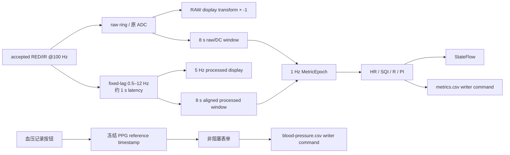

# M7 采集追溯、被试档案与界面优化开发规划

日期：2026-08-08  
规划版本：`M7.0`  
代码基线：`main` / `970d1f9` 之后的当前工作树  
状态：**规划已形成；M7.1 数据合同/命名/profile 内核已实现并通过本地综合门禁，M7.2 正在收口，M7.3～M7.5 尚未实现**

本文是用户 2026-08-08 提出的十项增量需求的实施主计划。它只覆盖新需求及其必需的兼容改造，不替代既有 BLE、wire protocol、`CUPRAW1`、raw-first、检查/恢复和 M6 离线分析证据。若本文与旧文档对“未来应做什么”的描述冲突，以本文为本次 M7 增量的优先规划；旧实现事实仍按其发生时间保留。

## 1. 代码审计结论

当前工程已经具备可复用的完整主干，不应重新开发采集底层：

- `LivePpgSignalRuntime` 对 accepted RED/IR 保持 800 点窗口，并以 100 点步长产生 1 Hz 指标请求；HR、SQI 和 ratio-of-ratios 已共享 `sourceSampleIndex/sourceTimeSeconds`。
- `RatioOfRatiosEstimator` 已在一次计算中产生 `redAcDcPercent`、`irAcDcPercent` 和 R；PI 可直接复用 `redAcDcPercent`，不应另跑一套 AC/DC。
- `CaptureSessionWriter` 保证原始 notification 先写 `CUPRAW1`，随后才派生固定 25 列样本 CSV；`red/ir` 当前直接写设备 `UInt` ADC。
- 录制期分析与 writer 分属两个 worker。当前分析结果只进入 `StateFlow`，没有可靠写入独立的 1 Hz 时序文件，也不能回填已经写出的样本 CSV 行。
- `CaptureForegroundService` 是录制 owner，Activity/Compose 只绑定和观察，适合增加不中断采集的手工血压命令。
- 当前命名只做 `[A-Za-z0-9_-]+`、空值、目录重名校验；没有建议名、subject/seq 解析、上次命名记忆或被试信息。
- `CaptureSessionMetadata`、repository、inspection/recovery/export 均假定每个会话只有 raw、样本 CSV、session JSON 三个必需文件。
- Saved Sessions 当前逐会话平铺，只支持单会话 ZIP 导出；已有详情、完整信号、离线分析和工作台可被档案页复用。
- Live 页是单个 `verticalScroll` 长页面。录制时虽隐藏名称框，但设备、状态、波形、指标和控制仍分散；输入框没有专门的 IME/bring-into-view 处理。
- 实时因果与离线 zero-phase 都复用 0.6～4 Hz 固定 SOS。离线 `ZeroPhasePpgFilter` 已有前后向实现，可作为 0.5～12 Hz 和 fixed-lag 方案的数值参考，但不能直接冒充无延迟实时滤波。

### 1.1 需求编号

本计划给用户需求分配以下 ID，后续 commit、状态和测试使用这些编号：

| ID | 需求摘要 |
|---|---|
| `M7-DSP-001` | RAW RED/IR 仅在显示层取负，落盘保持原 ADC |
| `M7-MET-001` | 复用 RED AC/DC 形成 PI |
| `M7-MET-002` | 生理参数统一 1 Hz，并具有同一 PPG 参考时间轴 |
| `M7-BP-001` | 录制中非阻塞录入多组收缩压/舒张压真值 |
| `M7-NAME-001` | 自由文件名、建议名、subject/seq 递增与严格校验 |
| `M7-SUB-001` | 性别/年龄/身高/体重/扩展信息及 subject 复用 |
| `M7-ARC-001` | 被试档案、seq 展开、详情复用和非标准文件分区 |
| `M7-EXP-001` | 会话/subject 多选聚合导出 |
| `M7-DSP-002` | 0.5～12 Hz 与接近 zero-phase 的 fixed-lag 实时方案 |
| `M7-UI-001` | 录制态紧凑布局、折叠、键盘避让及其它 UI 收尾 |

## 2. 本轮先冻结的设计决策

### 2.1 RAW 取负是纯显示变换

新增统一的 presentation transform，例如 `PpgDisplayTransform.rawPeakUp(values)`：

```text
displayRaw = -storedRaw
storedRaw  = decoded UInt32 ADC
```

该 transform 只在 Live RAW、会话 RAW 重放和工作台 RAW stage 绘图前调用。以下内容严禁改变：

- `CupPpgSample.red/ir`；
- `CUPRAW1` notification bytes；
- `{stem}.csv` 的 `red/ir`；
- ratio/PI 的 raw DC 输入；
- 协议 golden、inspection 和 recovery。

CAUSAL/fixed-lag/离线 zero-phase 数组按各自算法的极性契约显示，不因 RAW 展示需求被二次取负。图例和无障碍文案需写明“RAW 显示已反相，导出为原始 ADC”。

### 2.2 PI 与 R 同源、同算、同时间戳

`RatioOfRatiosEstimator.estimate()` 每个分析 epoch 只调用一次：

```text
red AC/DC (%) ───────────────→ PI（RED，%）
red AC/DC (%) / ir AC/DC (%) → R（ratio-of-ratios）
```

PI 值直接等于已有 `redAcDcPercent`，显示名为 `PI（RED AC/DC）`，单位 `%`。PI 与 R 共享输入窗口、trim、DC/AC 有效性、source index/time 和基础算法版本；可给 PI 单独的派生版本 `ppg-pi-red-acdc-0.1`。PI 不映射为血压、SpO2 或临床结论。

### 2.3 1 Hz 指标以 accepted PPG 样本为时钟

“每秒刷新”定义为每新增 100 个连续 accepted samples 形成一个 `MetricEpoch`，而不是依赖不稳定的墙钟 timer。一个 epoch 内 HR、SQI、R、PI 必须共享：

- `connection_generation`；
- `metric_epoch`；
- `source_sample_index`；
- `source_time_s = source_sample_index / 100.0`；
- `measured_utc`；
- 各自 value/valid/provisional/reason/algorithm version。

首次有效 epoch 仍在完整 8 秒窗口后产生。gap 后清空旧结果并重新 warm-up；不能继续显示或导出上一 generation 的旧值。无效计算也保留 epoch、source 和 reason，不能用旧值补位。

### 2.4 保留 25 列样本 CSV，新增 sidecar

为了保证旧 reader、raw/CSV inspection 和既有会话兼容，`{stem}.csv` 的 25 列/header 以及 `red/ir` 原 ADC 均不改。新增两个易流式读取的 sidecar：

```text
sessions/<stem>/
├── <stem>.cupraw
├── <stem>.csv                    # 现有 25 列，red/ir 原 ADC
├── <stem>.metrics.csv            # 新：1 Hz 指标序列
├── <stem>.blood-pressure.csv     # 新：手工参考血压事件序列
├── <stem>.session.json           # v2，含身份快照与 sidecar 清单
└── analysis/
```

老会话继续是 session v1 + 三文件；新 reader 必须同时支持 v1/v2。不得为了添加 PI 而扩写旧 25 列，也不得异步回填已落盘的样本行。

#### `<stem>.metrics.csv`

建议 schema：`ppgcollector_metrics_v1`。

```text
schema_version,session_id,connection_generation,metric_epoch,
source_sample_index,source_time_s,measured_utc,
heart_rate_bpm,heart_rate_valid,heart_rate_provisional,heart_rate_reason,heart_rate_alg_version,
sqi,sqi_valid,sqi_provisional,sqi_reason,sqi_alg_version,
ratio_of_ratios,ratio_valid,ratio_provisional,ratio_reason,ratio_alg_version,
perfusion_index_percent,pi_valid,pi_provisional,pi_reason,pi_alg_version
```

每个 epoch 恰好一行；四项指标不能分四次异步写。指标 sidecar 由 session 单一 writer 追加并随现有 1 秒 checkpoint 一起 `force()`。分析队列失败不得损坏 raw；metadata 要记录 metrics writer 状态和实际行数。

#### `<stem>.blood-pressure.csv`

建议 schema：`ppgcollector_manual_bp_v1`。

```text
schema_version,session_id,event_index,
dialog_open_source_sample_index,dialog_open_source_time_s,
dialog_open_host_monotonic_ns,dialog_open_utc,saved_utc,
systolic_mm_hg,diastolic_mm_hg
```

时间以“点击血压记录、弹窗创建”的瞬间冻结，保存时不改写为点击保存的时间。`saved_utc` 仅用于审计输入耗时。多次保存形成按 `event_index` 和 source time 排序的事件序列。

手工血压是 reference/ground truth event，不能写进 `LiveMetricSnapshot.bloodPressure`，也不能把当前 `MODEL_UNAVAILABLE` 改成计算有效。UI、metadata 和导出都使用“参考血压”字样。

### 2.5 文件名与 canonical subject 解析

自由文件名仍是会话目录和 stem，规则统一为：

- 1～64 个字符；
- 只允许 ASCII 大小写字母、数字、`_`、`-`；
- 拒绝中文、空格、路径字符和用户列出的全部特殊符号；
- 拒绝跨平台保留名，例如 `CON`、`PRN`、`AUX`、`NUL`、`COM1`～`COM9`、`LPT1`～`LPT9`；
- 重复校验按 `Locale.ROOT` lowercase 后比较，避免导出到大小写不敏感文件系统时碰撞；
- 已存在 complete、incomplete 或 recovery 目录都算重名。

canonical 名称解析为：

```text
^PPG-([A-Za-z0-9_][A-Za-z0-9_-]*)-([1-9][0-9]*)$
      └──────── subject ───────┘  └ seq
```

subject 允许内部短横线，最后一个“短横线 + 正整数”解释为 seq。`PPG-` 大小写固定；其它合法自由名称进入“未归档/非标准文件”分区，但仍可录制、查看和导出。

建议名不依赖易丢失的 SharedPreferences，而从实际 session metadata 重建：

1. 只考虑 `raw_chunk_count > 0` 的 canonical 会话，complete/incomplete 均算实际录制；
2. app 打开或一轮录制结束后，取最近实际使用的 canonical subject；
3. 建议 `PPG-{subject}-{maxExistingSeq+1}`，若碰撞继续寻找下一个空闲 seq；
4. 无历史时文件名保持空，placeholder 为 `PPG-<subject>-<seq>`，不提交伪造的 `PPG--`；
5. 用户可直接改写建议名；“建议命名”按钮允许输入/切换 subject，新 subject 默认 seq=1。

### 2.6 被试资料采用“全局修订 + 会话快照”

新增文件系统资料库：

```text
filesDir/subjects/<subject>.profile.json
```

profile 使用 versioned、atomic JSON，至少包含：

```text
schema_version,subject_id,current_revision,updated_utc,revisions[]
revision_id,created_utc,sex,age_years,height_cm,weight_kg,additional_fields
```

规则：

- 性别、年龄、身高、体重是默认必填字段；性别支持明确选项和“其它/未说明”，不推断；数字只做格式、正数和技术上限防御，不以未经确认的临床范围静默修改真值。
- `additional_fields` 是有界 key/value 列表，限制条数、key/value 长度和 JSON 总大小；内容可用 Unicode，文件名限制不扩散到资料内容。
- canonical subject 若已有 profile，表单预填最新 revision；用户修改时新增 revision，不重写历史 revision。
- 每个 session v2 metadata 固化 `subject_id/seq/profile_revision_id/participant_snapshot/profile_complete`。后续修改全局 profile 不改变旧会话快照。
- 合法但非 canonical 的自由文件名仍显示资料表单，资料只作为该 session 的 participant snapshot，`subject_id=null`，不会自动合并到档案。
- 允许先开始录制再补资料。正常用户停止时若必填项未完成，先提示补齐；断连/写错/系统停止仍必须立即安全 finalise，并在 metadata 标 `profile_complete=false`，不得编造默认人口学值。

### 2.7 0.5～12 Hz 与 fixed-lag 方案

直接的 causal IIR 无法得到真正 zero-phase；真正 forward/backward filter 依赖未来样本。推荐实现一个明确带延迟的 `FIXED-LAG 0.5–12 Hz` 显示/分析 runtime：

- 固定 SciPy 参考生成的 Butterworth SOS，采样率 100 Hz，0.5～12 Hz，系数写入 versioned profile 和 fixture；
- bounded 滑动窗口内执行 forward/backward；
- 保留约 1 秒右侧上下文，只提交已经稳定的内部 0.2 秒 block，因此波形仍可 5 Hz 发布，但显示源时间比最新 raw 约落后 1 秒；
- 已提交 block 不因新样本到来被回改；gap 后清空 buffer 和延迟状态并重新 warm-up；
- 所有指标仍按 100 accepted samples/epoch 统一刷新，并标注其真实 source sample/time，而不是 UI 到达时间。

候选方案需与完整记录的 0.5～12 Hz zero-phase 参考比较：中央有效区 waveform correlation、NRMSE、峰时偏差、AC/DC/PI 偏差、gap 泄漏、CPU/heap。若 fixed-lag 未达到门槛，保留可切换的旧 causal profile作为回退，不用“zero-phase”命名；若通过，提升 `preprocess_profile`/`alg_version`，旧 0.6～4 Hz fixture 和旧 session replay 保留。

建议准入目标：中央有效区相关系数不低于 0.98、相对 NRMSE 不高于 0.15、匹配峰中位时间误差不高于 20 ms、PI 相对偏差不高于 5%、运行状态有界。阈值若被真实 CUP 样本证明不合理，必须记录字段级报告后调整，不能只为“测试变绿”放宽。

## 3. 目标运行链路



写入器应从只接受 raw chunk 扩展为有界命令 actor，但 raw-first 优先级和失败语义不变：

```text
RawChunk        -> append CUPRAW1 -> decode -> append 25-column samples
MetricEpoch     -> append exactly one metrics row
ManualBpCommit  -> append exactly one BP event row
ProfileUpdate   -> atomic metadata checkpoint + subject revision link
Finish          -> drain raw, analysis result commands and manual events -> fsync -> metadata
```

Activity 不能直接持有文件句柄。血压弹窗打开时通过 service binder 获取 `CaptureReferenceTimestamp`；保存时把已冻结 token 和输入值发回 service/controller。Compose 弹窗、键盘和资料编辑不能暂停 BLE、writer 或 analysis worker。

## 4. 五轮开发安排

每轮只在全部代码和测试准备完后运行**一次综合校验命令**。不先跑定向测试再跑全量测试；失败则在同一轮修复后重新执行会被记录为该轮校验重试，而不是宣称一次通过。每轮收尾仍按项目规则更新双层 status、检查 diff 并提交本轮文件。真机门禁默认延期。

### 第 1 轮：M7.1 数据合同、命名与资料存储内核（已实现）

覆盖：`M7-MET-002`、`M7-BP-001`、`M7-NAME-001`、`M7-SUB-001`、`M7-EXP-001` 的底层前置。

目标：先让新文件、时间轴、subject/profile 和旧会话兼容成为可测试的纯 Kotlin 合同，不接大规模 UI。

新增文件建议：

- `data/session/SessionNamePolicy.kt`：自由名校验、canonical parser、case-insensitive duplicate、建议名算法。
- `data/session/SubjectProfile.kt`：profile/revision/snapshot models、bounded JSON codec、atomic repository。
- `data/session/CaptureMetricSeries.kt`：`MetricEpoch`、metrics CSV formatter/parser/stream scan。
- `data/session/CaptureBloodPressureSeries.kt`：reference timestamp、manual BP event、CSV formatter/parser/stream scan。
- `data/session/CaptureSessionFileManifest.kt`：v1/v2 会话文件集合和可选 sidecar 解析。

修改文件：

- `CaptureSessionMetadata.kt`：增加 session v2、participant snapshot、canonical subject/seq、sidecar 文件名/行数；v1 缺省读取。
- `CaptureSessionWriter.kt`：创建 sidecar header、统一 checkpoint/finish、metadata 行数；样本 CSV 保持 25 列。
- `CaptureSessionRepository.kt`：按 metadata/file manifest 列举 v1/v2 文件，而不是写死三文件。
- `CaptureSessionInspection.kt`：校验 sidecar header、递增 event/epoch、session ID 和 source time；老会话不报缺 sidecar。
- `CaptureSessionRecoveryService.kt`：对完整 sidecar 行做 safe-prefix copy，保留 provenance；源目录只读。
- `CaptureSessionExportService.kt`、`CaptureAndroidExport.kt`：导出 manifest 中声明的全部会话文件。
- `PpgCollectorApplication.kt`：提供 `subjectsRoot`。

测试文件：

- 新增 `SessionNamePolicyTest.kt`、`SubjectProfileRepositoryTest.kt`、`CaptureMetricSeriesTest.kt`、`CaptureBloodPressureSeriesTest.kt`。
- 扩展 metadata/writer/repository/inspection/recovery/export tests，固定验证 v1 三文件与 v2 五文件同时可读。
- 样本 CSV golden 增加“不改变 25 列和 raw red/ir”的断言。

退出条件：

- 旧 v1 会话无需迁移即可 list/inspect/replay/export；
- v2 sidecar 可 round-trip、截尾可安全识别；
- canonical parser、首次 subject seq=1、历史 subject seq+1、case-only 重名和保留名都有参数化测试；
- subject revision 不覆盖历史，会话 participant snapshot 可独立解码；
- 本轮不改变算法、波形或 Compose 页面。

唯一综合校验：

```text
./gradlew test lintDebug assembleDebug assembleDebugAndroidTest :app:verifyReleasePrivacy --no-configuration-cache --no-daemon
```

建议 commit：`feat(M7.1): add traceable session sidecars and subject contracts`

### 第 2 轮：M7.2 RAW 显示、PI、统一指标与 0.5～12 Hz fixed-lag

覆盖：`M7-DSP-001`、`M7-MET-001`、`M7-MET-002`、`M7-DSP-002`。

目标：在同一 source timeline 上形成 RAW/processed waveform 和 HR/SQI/R/PI，并把每个 1 Hz epoch 可靠送到 writer。

新增文件建议：

- `core/signal/PpgDisplayTransform.kt`：只供 presentation 使用的 raw `-x` 变换。
- `core/signal/FixedLagPpgFilterRuntime.kt`：bounded 0.5～12 Hz forward/backward block runtime、latency/source range/gap 状态。
- `app/src/test/resources/signal/fixed_lag_0_5_12_vectors.json`：由受控 SciPy 脚本生成的合成参考，不修改只读 `reference_sources`。

修改文件：

- `PpgPreprocessing.kt`：增加 versioned 0.5～12 Hz SOS profile，保留 `iosBaseline01`。
- `OfflinePpgAnalysis.kt`：zero-phase filter 接收显式 profile，避免继续硬编码 0.6～4 Hz。
- `LivePpgSignalRuntime.kt`、`LiveMetricRuntime.kt`：统一 fixed-lag/source cursor、1 Hz `MetricEpoch`；generation 变化立即清空旧 result。
- `RatioOfRatiosEstimator.kt`：保持一次 estimate，显式暴露 PI 派生结果。
- `LiveMetricModels.kt`：增加 PI metric；computed BP 仍 unavailable。
- `BlePreviewRuntime.kt`、`CaptureRecordingController.kt`：preview/recording 使用同一 profile 语义；analysis result 通过 writer command 写 metrics sidecar。
- `MainActivity.kt`、`SessionSignalWorkbench.kt`、`SessionsScreens.kt`：Live RAW 与所有 RAW replay 绘图前取负；processed stage 不二次取负；显示 PI 和共同 source time。
- `CaptureSessionWriter.kt`：接收完整 epoch，不拆分写入。

测试重点：

- RAW display helper 对称、non-finite 边界和输入不可变；writer/CSV 仍得到原 ADC。
- Ratio estimator 只调用一次即可同时得到 R/PI；PI=`redAcDcPercent`，invalid reason/source/version 一致。
- 每 100 accepted samples 恰好一个 epoch，HR/SQI/R/PI source index 完全相同；gap 后旧数字消失并重新 warm-up。
- fixed-lag 与完整 0.5～12 Hz zero-phase 的相关、NRMSE、峰时和 PI 偏差；buffer/CPU 有界；gap 两侧不串滤波状态。
- 旧 0.6～4 Hz profile、旧 analysis artifact 和旧 session replay 继续可读。

退出条件：

- Live/recording/metrics sidecar 三处观察到同一个 epoch ID/source time；
- raw/csv SHA 或字段不受显示反相影响；
- UI 明确显示 fixed-lag 延迟，不使用“实时 zero-phase”字样；
- 若候选未达到准入门槛，旧 causal 仍可选且状态文档记录真实比较结果。

唯一综合校验：与 M7.1 相同的单次完整 Gradle 命令。

建议 commit：`feat(M7.2): align live PI metrics and fixed-lag PPG display`

### 第 3 轮：M7.3 录制工作流、身份编辑与参考血压

覆盖：`M7-BP-001`、`M7-NAME-001`、`M7-SUB-001`，只做功能所需 UI，不做最终视觉重排。

目标：用户可以自由命名、采用建议名、在录制前后补/改资料，并在不中断采集的弹窗内录入多组参考血压。

新增文件建议：

- `CaptureSetupModels.kt`：名称建议、表单状态、field validation、participant draft。
- `CaptureSetupScreen.kt`：名称/建议名/身份表单组件，从 1200 行 `MainActivity.kt` 中拆出。
- `ManualBloodPressureDialog.kt`：弹窗状态、冻结 timestamp、数值校验和保存反馈。

修改文件：

- `CaptureServiceViewModel.kt`：组合名称、duplicate、participant completeness、active session；缓存 draft 并同步 subject repository。
- `CaptureForegroundService.kt`：start intent 固化 participant snapshot；binder 暴露 `captureReferenceTimestamp()`、`commitManualBloodPressure()`、`updateParticipantProfile()`。
- `CaptureRecordingController.kt`：跟踪最新 accepted source cursor；接收有界 BP/profile command；stop/finalizer 排空事件。
- `CaptureSessionWriter.kt`：只由 writer owner 追加 BP，active profile 更新触发 metadata checkpoint。
- `MainActivity.kt`：录制后显示“血压记录”按钮；弹窗不改变连接、录制、波形和指标 StateFlow 收集。

交互规则：

- app 启动自动给出最近 canonical subject 的下一 seq 建议；没有历史时保持空文件名和示例 placeholder。
- 用户输入合法且不重名文件名后身份表单激活；canonical subject 自动预填最新资料，非 canonical 使用 session-local 空表单。
- canonical 新 subject 的建议 seq 为 1；subject 变化重新查 profile，但不得无提示覆盖用户已编辑 draft，需确认或只在 pristine draft 时预填。
- 允许资料未完成时开始；录制卡持续提示。正常停止前提示补齐，强制/错误停止照常 finalise 并标 incomplete profile。
- “血压记录”仅在 RECORDING 时出现。点击即冻结 session ID/generation/sample/time/monotonic/UTC；取消不写行；保存只在同一 active session 接受。
- 收缩压/舒张压保存为正整数且有宽松技术上限；异常关系只警告用户确认，不静默改值。重复点击保存需 event token 幂等去重。
- 弹窗打开、输入、旋转和 Activity 重建不暂停 writer；录制结束后旧 token 不能写入下一 session。

测试重点：

- 建议名跨重启由 filesystem 重建；实际 raw 为空的预留目录不推进 seq。
- start intent/profile update/metadata snapshot 一致；subject revision 与旧 session 快照隔离。
- BP timestamp 使用打开时而非保存时；多条 event 排序、幂等、session/generation 拒绝和 finalizer 竞争。
- Compose semantics 至少覆盖按钮仅录制态出现、字段错误和保存成功反馈；instrumentation 本轮只编译，不宣称 emulator 运行通过。

唯一综合校验：与 M7.1 相同的单次完整 Gradle 命令。

建议 commit：`feat(M7.3): add guided capture identity and manual BP events`

### 第 4 轮：M7.4 被试档案与批量导出

覆盖：`M7-ARC-001`、`M7-EXP-001`。

目标：用 subject-first 档案替代默认逐文件列表，同时完整保留非 canonical/legacy 会话入口；支持任意会话和 subject 批量导出。

新增文件建议：

- `data/session/SubjectArchiveRepository.kt`：从 session metadata + subject profiles 重建 archive，无不可恢复数据库真源。
- `data/session/CaptureArchiveExportService.kt`：多会话流式 ZIP、selection manifest、collision-safe entry path。
- `SubjectArchiveModels.kt`、`SubjectArchiveScreen.kt`：subject summary、展开 seq、未归档 tab、多选状态。

修改文件：

- `SessionsViewModel.kt`：从单一 selected session 扩展为 archive groups、view mode、selected session set、selected subject set、export progress/cancel。
- `SessionsScreens.kt`：默认“被试档案”，可切“逐文件/未归档”；subject card 可展开 seq；session detail 继续复用。
- `SavedSessionDetailScreen`/`SessionSignalWorkbench.kt`：显示 participant snapshot、profile revision、参考 BP 列表，并在 waveform 时间轴上绘制可开关的 BP event marker。
- `MainActivity.kt`：批量 `CreateDocument` launcher 与建议 ZIP 名。
- `CaptureSessionExportService.kt`：保留单会话 adapter，内部委托新的 archive exporter，避免两套 ZIP 规则漂移。

档案摘要规则：

- subject 卡：subject ID、recording count、最大 seq、首/末录制时间、完整/异常数、参考 BP 组数。
- HR 摘要优先读取 metrics sidecar 的 valid HR；旧会话回退到最新离线 artifact；没有证据显示“不可用”，不扫大样本 CSV 猜测。
- seq 按数值排序，不按字符串排序；保留 seq 缺口，不把 `1,3` 伪装成两次连续录制。
- canonical 名称但缺/坏 profile 仍归入 subject，标“资料缺失”；非 canonical、无法解析和损坏 metadata 进入“未归档”，不能消失。

批量 ZIP 结构建议：

```text
export_manifest.json
subjects/<subject>/<stem>/<session files...>
unclassified/<stem>/<session files...>
subject_profiles/<subject>.profile.json
```

`export_manifest.json` 记录 export schema/time、选择方式、subject/session ID、entry path、size/hash、缺失/跳过原因。选择一个 subject 等价于选中其当前全部 seq；选择多个 subject 求并集去重。导出过程中源文件只读、64 KiB streaming buffer、可取消，partial destination 不冒充成功。

测试重点：

- subject/seq 分组、损坏/legacy/noncanonical 分区、summary precedence 和 seq 数值排序。
- 单会话、跨 subject、多 subject 全选、重复选择去重、同名 entry 防碰撞、missing sidecar、取消和进度。
- ZIP manifest 与实际 entries/size/hash 一致；v1/v2 会话都可导出。

唯一综合校验：与 M7.1 相同的单次完整 Gradle 命令。

建议 commit：`feat(M7.4): add subject archives and multi-session export`

### 第 5 轮：M7.5 录制页 UI 收敛与整体验收

覆盖：`M7-UI-001`，并对 M7.1～M7.4 做一次集成收尾。按用户要求，视觉与布局优化放在全部功能之后。

目标布局：

- 将 Live 页面拆为 screen-level state + 小 Composable，避免继续扩张 `MainActivity.kt`。
- 非录制态保留完整扫描、连接、命名和资料设置。
- 录制态默认折叠“扫描列表、权限详情、版本/诊断、完整人口学表单”，只保留可展开摘要。
- 录制态首屏优先顺序：紧凑连接状态/断开 → RED → IR → HR/SQI/R/PI → 血压记录/停止并保存；长屏仍可滚动。
- 使用 `Scaffold` 固定或 sticky 的录制操作栏，让“血压记录、停止、断开”始终可达；危险操作颜色与二次确认一致。
- 波形高度和指标卡在小屏/横屏按 `BoxWithConstraints` 自适应；不牺牲 RED/IR 独立 Y、source time 和 TalkBack 语义。
- 用 `LazyColumn`/明确 item key 替换整页 `verticalScroll`；对表单应用 `WindowInsets.ime`、`imePadding()` 和 focused-field `BringIntoViewRequester`，键盘弹出后当前文本框保持可见。
- 表单大字段采用下一项/完成 IME action；关闭弹窗恢复焦点；旋转后保留 draft、打开时 BP reference token 和折叠状态，但不复用旧 session token。
- 档案页补动态字号、空态、错误行动建议、多选工具栏、选择计数和导出进度；颜色之外同时使用文字/图标表达状态。

建议新增/拆分：

- `LiveCaptureScreen.kt`、`LiveWaveformCard.kt`、`LiveMetricGrid.kt`、`CaptureActionBar.kt`、`CaptureForms.kt`。
- `CaptureUiState.kt` 作为页面单一状态；波形仍单独按 5 Hz revision 收集，避免整页重组。
- 扩展 `WaveformAccessibilityTest.kt`、`MainActivitySystemTest.kt` 和 Compose semantics tests。

最终集成断言：

- 一次 synthetic session 同时产生原始 ADC sample CSV、1 Hz HR/SQI/R/PI、两组 BP 和 participant snapshot；全部 source time 可回指 sample index。
- RAW Live/replay 视觉取负，但 raw/csv/inspection SHA 和数值不变。
- canonical seq 自动递增、资料复用/修订、档案分组和多选导出闭环。
- 录制时打开键盘、BP dialog、切换页面或 Activity recreation 不产生第二 writer/GATT，不丢 raw。
- 30 min/2 h JVM bounded test 扩展检查 metrics/BP/profile 文件大小与内存不随 UI 对象无界增长。
- 旧 v1/旧算法/旧分析结果继续可见、可检查、可导出。

唯一综合校验：

```text
./gradlew test lintDebug assembleDebug assembleDebugAndroidTest :app:verifyReleasePrivacy --no-configuration-cache --no-daemon
```

真机延期门禁：IME 遮挡、5 Hz fixed-lag 观感、1 秒延迟、旋转/后台/锁屏、TalkBack、动态字号、真实多次 BP 录入、SAF 大批量 ZIP、真实 2 小时 CPU/heap/功耗。

建议 commit：`feat(M7.5): compact capture UI and complete M7 integration`

## 5. 需求到轮次与证据映射

| 需求 | 主轮次 | 关键 Android 文件 | 最小证据 |
|---|---:|---|---|
| RAW 显示取负、落盘不变 | 2 | display transform、MainActivity、workbench、writer | display arrays=-raw；CSV/golden/raw SHA 不变 |
| PI | 2 | Ratio estimator、metric models/runtime/UI | 单次 estimate；PI=RED AC/DC；同 source |
| 统一 1 Hz/时间戳 | 1～2 | MetricSeries、runtime、controller/writer | 100-sample cadence；四指标共享 epoch/source |
| 手工血压 | 1、3 | BP series、FGS binder、controller、dialog | open timestamp；多事件；录制不中断 |
| 文件命名 | 1、3 | SessionNamePolicy、ViewModel/form | 参数化非法字符/空/重名/建议 seq |
| 被试信息 | 1、3 | SubjectProfile、metadata、form | revision + session snapshot + active update |
| 被试档案 | 4 | archive repository/ViewModel/screen | canonical group + noncanonical/legacy 保留 |
| 多选导出 | 1、4 | file manifest/archive exporter | 多 session ZIP manifest/stream/cancel |
| 0.5～12/fixed-lag | 2 | preprocessing/fixed-lag/offline/runtime | SciPy fields、相似度、latency、gap、bounded |
| UI 优化 | 5 | LiveCapture screens/action bar/forms | compact state、IME、semantics、recreation compile |

## 6. 旧文档治理：保留、修订与遮蔽

“遮蔽”采用显式 superseded banner 和入口优先级，不删除历史，也不改写已经发生的测试事实。

### 6.1 需要部分遮蔽的文档

| 文档 | 处理 | 原因 |
|---|---|---|
| `docs/07_LIVE_FILTERED_WAVEFORM_PLAN.md` | 本轮已在顶部标记“**M6 0.6～4 Hz 已实现历史基线；M7 未来滤波目标由 docs/09 接管**” | 其“保持 0.6～4、不改变 cadence/profile”与本次 0.5～12/fixed-lag 未来目标冲突，但 M6 实现证据必须保留 |
| `docs/08_REMAINING_MIGRATION_AUDIT.md` | 本轮已在顶部标记“**2026-08-02 历史快照；M7 新需求余项以 docs/09 为准**” | 该审计把 M7 视为证据未知的延后专家功能，已不足以代表当前待办 |

### 6.2 需要在 M7.1 同步修订的文档

| 文档 | 必须修改的内容 |
|---|---|
| `00_AGENT_MIGRATION_BRIEF.md` | 当前迭代、M7 映射、sidecar/subject/manual BP/RAW display/fixed-lag 不可破坏边界；明确 computed BP 仍 unavailable |
| `docs/01_ANDROID_MIGRATION_MASTER_PLAN.md` | 产品范围和运行链路；把手工 BP 真值与算法 BP 分开；加入 subject archive/multi-export |
| `docs/02_REQUIREMENTS_AND_PARITY_MATRIX.md` | 新增本计划十个 requirement ID 与字段级验收，旧 UI-004 只限制“计算 BP” |
| `docs/03_ARCHITECTURE_AND_DATA_CONTRACTS.md` | session v2、两个 sidecar、subject profile/revision、writer commands、timestamp/reference 和 export manifest |
| `docs/04_IMPLEMENTATION_ROADMAP_AND_ACCEPTANCE.md` | 追加 M7.1～M7.5 五轮及“每轮一次综合校验”规则，不重写旧 phase 历史 |
| `docs/05_SOURCE_REFERENCE_INDEX.md` | 增加当前 Android 目标索引；注明新需求主要来源是用户增量而非旧 iOS parity |
| `docs/06_OPEN_DECISIONS_AND_RISK_REGISTER.md` | 增加 fixed-lag 延迟、人口学隐私、manual BP 对齐、批量导出泄漏/碰撞风险 |
| `REALTIME_AND_STORAGE.md` | 每轮按实际代码更新，不提前把规划写成已实现；M7.2 后补 metrics/PI/filter，M7.3 后补 BP/profile，M7.4 后补 archive export |

### 6.3 应保留且不遮蔽的资料

- `reference_sources/**`：继续只读；旧 Swift 的 BP unavailable 仍是“算法血压不可用”的有效依据，不妨碍新增手工参考血压。
- ADR-0001～0005：Android foundation、BLE 和 wire 决策与本次功能不冲突。
- `DEVELOPMENT_STATUS_DETAILED.md`：只追加事实，历史的 0.6～4、25 列、三文件和 M6 结果不得重写成当时已支持 M7。
- preprocessing/HR/SQI/protocol fixtures：作为旧版本回归证据继续保留；0.5～12 使用新的 versioned fixture，不能覆盖旧向量。
- 现有 `CaptureSessionAnalysis` artifacts：不可覆盖，旧 profile 继续由详情页读取。

### 6.4 应避免继续引用为新需求依据的内容

- `docs/07` 中“未来仍固定 0.6～4 Hz”的建议；它只解释 M6 基线。
- `docs/08` 中“M7 未开始且没有范围”的结论；从 M7.0 起由本文定义范围。
- 旧文档中“BP unavailable”的笼统表述；后续必须写成“计算 BP unavailable，手工 reference BP 可记录”。
- 当前 `MainActivity.kt` 内旧的私有 `SessionsPanel` 平铺实现；正式档案页应基于独立 `SessionsScreens.kt`/新 archive screen，不复制两套页面。

## 7. 风险、边界与延期项

- **算法版本风险**：0.5～12 Hz 会改变 HR/SQI/R/PI 数值分布。必须提升 preprocess/algorithm version，不能用旧 `ppg-ios-*` 名称宣称 parity。
- **延迟认知风险**：fixed-lag 约 1 秒。UI 同时显示 source time 与“约 1 s 延迟”；若产品要求 <200 ms，回退 causal，而不是隐藏延迟。
- **时间轴风险**：BP 弹窗保存可能晚于打开数十秒。以 open token 为准，saved time 只审计；token 必须绑定 session ID/generation。
- **写入背压风险**：metrics/BP 不能挤占 raw 真源。控制命令有独立有界队列/明确失败；raw overflow 语义保持现状。
- **隐私风险**：subject profile、年龄和身体信息属于敏感数据。内部存储、备份排除、显式导出和最小日志策略继续适用；批量导出前显示 subject/session 数量。
- **档案错误合并风险**：只按严格 canonical parser 的 subject 分组，不用相似字符串、设备 ID 或人口学信息猜测同一人。
- **资料随时间变化**：年龄/身高/体重保存 session snapshot + profile revision，不把最新资料回写旧 seq。
- **旧会话兼容**：不批量迁移或重命名旧目录；legacy/noncanonical 永远可见。
- **真机证据延期**：本五轮优先 JVM/fake/static/build。真实 BLE、IME/OEM、FGS、SAF、TalkBack、性能和 2 小时门禁仍按项目约定待用户指定测试轮执行。

## 8. M7 完成定义

只有以下条件同时成立，才能说本计划的代码范围完成：

1. Live 与所有 session RAW 绘图峰向上，且 raw/样本 CSV 的 ADC 字节与数值逐项不变。
2. HR/SQI/R/PI 每 100 accepted samples 同步产生，所有 valid/invalid epoch 都有可回指 PPG 的 source index/time。
3. PI 来自同一次 R estimate 的 RED AC/DC，不重复或漂移计算。
4. 任意录制可保存多组以 dialog-open 时间对齐的手工参考 BP，录入过程不停止 BLE/raw/metrics。
5. 文件名自由、严格合法、不可重名；建议名跨重启从实际会话重建并正确 seq+1。
6. 资料可在录制前后录入，subject 复用最新 revision，旧 seq 保留当时 snapshot。
7. canonical subject、seq、legacy/noncanonical 均在档案/文件视图可达；详情显示资料和 BP，并复用既有工作台。
8. 可选择任意会话、一个或多个 subject 进行单一 ZIP 导出，manifest 与实际内容一致。
9. 0.5～12 Hz fixed-lag 有 version、延迟、数值比较和 bounded 证据；不冒充无延迟 zero-phase。
10. 录制态核心操作和 RED/IR/指标尽量首屏可达，键盘不遮挡焦点输入框；Activity 重建不创建第二 owner。
11. session v1/v2、旧算法/新算法、旧 analysis artifacts 都可读取；inspection/recovery/export 不破坏源文件。
12. 每轮仅执行一次已记录的综合校验，双层 status 与 commit 对应 M7.1～M7.5；真机未执行的项目明确标 pending。
