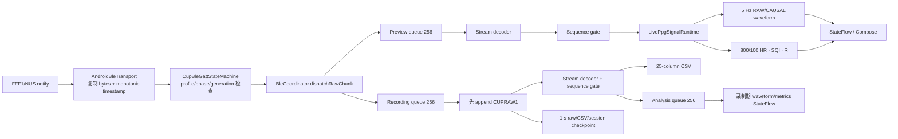

# PPGCollector Android 实时数据处理与数据存储实现指南

日期：2026-08-05

代码基线：`main` / `899d8e2`

适用范围：当前 NUS/FFF0 bring-up transport、168-byte planar PPG 协议、历史 408-byte raw 回放兼容、实时 RAW/CAUSAL 波形、HR/SQI/R 指标、`CUPRAW1`/CSV/session/analysis 文件链路。

本文描述的是当前仓库中已经实现的行为，不是理想化设计。实时链路和录制链路共享协议、sequence 与信号语义，但各自拥有独立、有界的 decoder/runtime 状态；录制始终以原始 BLE notification 为真源。

## 1. 总体结论

当前实现可以概括为两条并行链路：

1. **实时预览链路**：BLE notification → 有界 preview queue → 流式组帧 → sequence gate → 单一因果信号 runtime → 5 Hz 波形快照与每 100 samples 指标快照 → `StateFlow` → Compose。
2. **可靠录制链路**：同一 notification → 有界 recording queue → 先写 `CUPRAW1` → 再以 production decoder/sequence gate 派生 CSV → 每秒 checkpoint raw/CSV/session metadata → 停止后统一 finalization。



关键边界：

- Android GATT callback 不做协议重组、滤波、DFT、文件 I/O 或 Compose 更新。
- preview queue 溢出只损失预览并报告错误，不阻断独立的 raw recording sink。
- recording queue 溢出不静默丢弃：本次 chunk 不确认，录制以 `resourcePressure` 停止并标记 incomplete。
- 8-byte auxiliary 帧保留在 raw 中，但不产生 PPG sample、sequence、freshness、CSV 行或指标输入。
- duplicate/out-of-order 帧保留在 raw 与诊断中，但不进入 accepted sample 流；gap 帧本身接受，同时重置实时连续窗口。

## 2. 实时数据处理方案

### 2.1 BLE transport 与 notification 接入

BLE profile 定义在 [`BleModels.kt`](../../app/src/main/java/com/example/ppgcollector_android/core/ble/BleModels.kt) 的 `CupBleDeviceProfile`：

| Profile | Service | Notify | Control | 当前策略 |
|---|---|---|---|---|
| `cup-nus-bringup-0.1` | `6E400001-...` | `6E400003-...` | `6E400002-...` | 保留旧设备兼容 |
| `cup-fff0-bringup-0.1` | `0000FFF0-...` | `0000FFF1-...` | `0000FFF2-...` | 新设备 profile；暂不发送未知 FFF2 命令 |

`CupBleGattStateMachine.handleServices()` 根据设备实际发现的 service UUID 精确选择 profile；`handleCharacteristics()` 检查 notify 特征及 notify/indicate 能力；`handleValue()` 仅在当前设备、当前 connection generation、已订阅/接收 phase 且 notification 非空时创建 `BleRawNotificationChunk`。

平台回调由 [`AndroidBleTransport.kt`](../../app/src/main/java/com/example/ppgcollector_android/core/ble/AndroidBleTransport.kt) 的两个 `onCharacteristicChanged()` 重载接收，并统一进入 `emitCharacteristicValue()`：

- 立即复制 `ByteArray`，避免平台对象后续复用或修改；
- 同时记录 `SystemClock.elapsedRealtimeNanos()` 对应的 monotonic timestamp；
- 再投递成 `BleTransportEvent.ValueReceived`，交由单一有序 owner 处理。

[`BleCoordinator.kt`](../../app/src/main/java/com/example/ppgcollector_android/core/ble/BleCoordinator.kt) 的 `dispatchRawChunk()` 把每个合法 notification 同时送往：

- `BlePreviewRuntime.offer()`：始终存在的实时预览；
- `recordingRawSink`：只有前台录制启动后才安装的录制入口。

### 2.2 CUP 流式协议解析

协议常量与单帧解析位于 [`CupBatchProtocol.kt`](../../app/src/main/java/com/example/ppgcollector_android/core/protocol/CupBatchProtocol.kt)：

| 偏移 | 长度 | 当前 168-byte PPG 帧 |
|---:|---:|---|
| 0 | 2 | 固定帧头 `AB BA` |
| 2 | 1 | function `0x15` |
| 3 | 2 | little-endian data length `161` (`A1 00`) |
| 5 | 1 | UInt8 sequence |
| 6 | 80 | 20 × UInt32 LE RED |
| 86 | 80 | 20 × UInt32 LE IR |
| 166 | 2 | 固定帧尾 `CD DC` |

核心符号：

- `CupBatchProtocolV1`：帧长、offset、采样率和 profile identifier；
- `decodeCupBatchFrame()`：校验 header/function/length/tail，并按 planar offset 解出 20 组 RED/IR；
- `encodeCupBatchFrame()`：只生成当前 168-byte 帧，用于 fixture/test；
- `CupBatchFrame.protocolProfileIdentifier`：按 20/50 samples 标记当前/legacy profile。

[`CupBatchStreamDecoder.kt`](../../app/src/main/java/com/example/ppgcollector_android/core/protocol/CupBatchStreamDecoder.kt) 的 `CupBatchStreamDecoder.feed()` 面向任意 notification 边界增量处理：

- 支持一帧被拆到多个 notification、一个 notification 含多帧、帧间噪声与 header 重同步；
- 缓冲上限默认为最大帧长的 2 倍，避免无限增长；
- 首个合法数据帧后锁定 data length，单次连接/重放内不允许 168/408 布局静默切换；
- 历史 `408-byte / 50 RED-IR interleaved` 只用于已有 raw/session 回放兼容；
- function `0x02/0x06/0x0C/0x0F` 只有在总长精确为 8 且 tail 正确时计入 `auxiliaryFrames` 并消费；未知 function 或坏 tail 仍计结构错误。

### 2.3 Sequence gate 与 accepted sample 时间轴

[`CupFrameSequenceTracker.kt`](../../app/src/main/java/com/example/ppgcollector_android/core/protocol/CupFrameSequenceTracker.kt) 的 `observe()` 使用 UInt8 环形差值 `(current - previous) & 0xFF`：

| 事件 | 判定 | 是否接受 PPG 样本 | 后续动作 |
|---|---|---:|---|
| `First` | 首帧 | 是 | 建立 sequence 基线 |
| `Continuous` | delta = 1 | 是 | 连续处理 |
| `Gap(n)` | delta = 2…127 | 是 | 累计缺帧/缺样本；实时滤波和 8 s 窗口清空后重新 warm-up |
| `Duplicate` | delta = 0 | 否 | 只累计诊断，不推进 sample index |
| `OutOfOrder` | delta ≥ 128 | 否 | 只累计诊断，不修改 previous |

decoder 输出的 `CupBatchFrame` 会包装成 [`CupDecodedFrameEvent.kt`](../../app/src/main/java/com/example/ppgcollector_android/core/protocol/CupDecodedFrameEvent.kt) 中的 `CupDecodedFrameEvent`，`isAccepted` 是 preview、CSV、重放和离线分析共同遵循的入口门槛。

accepted `sample_index` 是从 0 开始的连续计数，不为缺失样本补空行或插值；`device_time_s = sample_index / 100`。离线完整信号分析会另外利用 sequence gap 建立 discontinuity/break，以避免 zero-phase 或窗口跨 gap。

### 2.4 单一实时信号 runtime

production preview 与 recording analysis 各自持有一个 [`LivePpgSignalRuntime.kt`](../../app/src/main/java/com/example/ppgcollector_android/core/signal/LivePpgSignalRuntime.kt) 的 `LivePpgSignalRuntime`。每个 runtime 内部只有一组逐样本预处理状态，并从同一 bounded ring 同时生成波形与指标请求。

`LivePpgSignalRuntime.ingest()` 的处理顺序为：

1. 核对调用方给出的 `acceptedSampleStartIndex`；索引不连续时调用 `invalidateContinuity()`。
2. 忽略未 accepted 的 decoded event。
3. accepted gap 到来时原子重置 RED/IR 预处理器、raw/causal rings、metric warm-up 和 waveform deadline。
4. 每个样本分别经 RED/IR `PpgPreprocessor.process()`，同时保存 raw 与 causal bandpassed 值。
5. ring 最多保存 800 samples（8 s）；超过上限后覆盖最旧样本。
6. 按 wall-clock 最多 5 Hz 生成 `LiveWaveformSnapshot`；worker 延迟时跳过过期 publication，不补发历史 burst。
7. 连续样本首次达到 800 时生成指标请求，随后每增加 100 samples 再生成一次，即 8 s window / 1 s cadence。

`LiveWaveformSnapshot` 同时包含：

- `red` / `ir`：原始 UInt32 转 Double 的 800 点尾窗；
- `causalRed` / `causalIr`：实时因果滤波后的同一尾窗；
- source sample 起止索引、generation、publication sequence、时间戳；
- `preprocessProfile`、连续样本数、800 点 warm-up 和起始约 2 s settling 提示信息。

production owner 不再使用旧的 `LiveWaveformSnapshotScheduler` 或 `LiveMetricWindowScheduler` 维护第二套状态；这两个类保留作纯 Kotlin 兼容/测试 seam。

### 2.5 实时预处理

预处理实现在 [`PpgPreprocessing.kt`](../../app/src/main/java/com/example/ppgcollector_android/core/signal/PpgPreprocessing.kt)：

- `PpgPreprocessingProfile.iosBaseline01`：100 Hz，profile id `ios_baseline_0.1`；
- `PpgPreprocessor.process()`：0.5 s DC tracker 去基线，然后执行固定的 3 阶、3 个 SOS causal Butterworth 0.6–4 Hz bandpass；
- `PpgPreprocessor.reset()`：gap、连接 generation 或非法输入后清空 DC/SOS 状态；
- `PpgWindowNormalizer.normalize()`：按算法需要执行 polarity transform、去均值和标准差归一化。

实时路径不能使用离线 `sosfiltfilt`/zero-phase，因为它依赖未来样本。离线 zero-phase 只存在于 session analysis 路径，使用独立 profile/version。

### 2.6 实时指标

[`LiveMetricRuntime.kt`](../../app/src/main/java/com/example/ppgcollector_android/core/signal/LiveMetricRuntime.kt) 的 `LiveMetricAnalyzer.analyze()` 接收一个不可变 800 点请求，并输出 `LiveMetricAnalysisResult`：

| 指标 | 输入与函数 | 当前语义 |
|---|---|---|
| Heart rate | causal IR + time；`HeartRateEstimator.estimate()` / `acceptedBpm()` | peak/spectral/置信度门控；版本 `ppg-ios-hr-0.1` |
| SQI | causal IR → `PpgWindowNormalizer.normalize()` → `TemplateMatchSqi.compute()` | template-match；当前仍 provisional，版本 `ppg-ios-sqi-0.1` |
| Ratio of ratios | raw RED/IR + causal RED/IR；`RatioOfRatiosEstimator.estimate()` | 边缘 trim、AC RMS/DC mean；仅诊断、provisional，版本 `ppg-ios-rr-0.1` |
| SpO2 | 无 | `CALIBRATION_UNAVAILABLE`，不得由 R 直接换算 |
| Blood pressure | 无 | `MODEL_UNAVAILABLE` |

相关文件：

- [`HeartRateEstimator.kt`](../../app/src/main/java/com/example/ppgcollector_android/core/signal/HeartRateEstimator.kt)
- [`TemplateMatchSqi.kt`](../../app/src/main/java/com/example/ppgcollector_android/core/signal/TemplateMatchSqi.kt)
- [`RatioOfRatiosEstimator.kt`](../../app/src/main/java/com/example/ppgcollector_android/core/signal/RatioOfRatiosEstimator.kt)
- [`LiveMetricModels.kt`](../../app/src/main/java/com/example/ppgcollector_android/core/signal/LiveMetricModels.kt)

每个 `MetricResult` 都携带 `value/isValid/isProvisional/unavailableReason/measuredAt/sourceSampleIndex/sourceTimeSeconds/algorithmVersion/calibrationId`，UI 不应在 stale、gap、warm-up 或计算失败后继续展示旧数值。

### 2.7 线程、队列和失败策略

| Owner/线程 | 入口函数 | 队列上限 | 执行内容 | 溢出/失败行为 |
|---|---|---:|---|---|
| Android BLE callback/main handler | `emitCharacteristicValue()` | 平台串行投递 | 复制 bytes、时间戳、转事件 | callback 不做重计算/I/O |
| `ppg-ble-preview` | `BlePreviewRuntime.offer()` / `process()` | 256 chunks | decode、sequence、waveform、metric analyze | 只报告 `droppedChunkCount`；recording sink 独立 |
| `ppg-capture-writer` | `CaptureRecordingController.onRawChunk()` / `workerLoop()` | 256 chunks | raw-first、decode、CSV、checkpoint | queue 满则 `RESOURCE_PRESSURE`，停止为 incomplete |
| `ppg-capture-analysis` | `analysisLoop()` | 256 decoded inputs | 录制期 waveform/metric | overflow 只使 analysis FAILED；已写 raw 不受影响 |

connection generation 变化或连接退出 subscribed/receiving 时，`BleCoordinator.publish()` 调用 `BlePreviewRuntime.reset()`，清空旧 queue、decoder、sequence 和 signal runtime，防止晚到 callback 污染新连接。

### 2.8 实时状态如何到达 UI

- [`BlePreviewRuntime.kt`](../../app/src/main/java/com/example/ppgcollector_android/core/ble/BlePreviewRuntime.kt) 发布 `StateFlow<BlePreviewSnapshot>`；
- [`CaptureRecordingController.kt`](../../app/src/main/java/com/example/ppgcollector_android/data/session/CaptureRecordingController.kt) 发布 recording、analysis、waveform 三组 `StateFlow`；
- [`CaptureForegroundService.kt`](../../app/src/main/java/com/example/ppgcollector_android/CaptureForegroundService.kt) 在长录制期间持有 controller，并通过 binder 暴露 flows；
- [`CaptureServiceViewModel.kt`](../../app/src/main/java/com/example/ppgcollector_android/CaptureServiceViewModel.kt) 的 `CaptureServiceClient.observeRecording()`、`observeAnalysis()`、`observeWaveform()` 绑定 service flow，`CaptureViewModel.previewState` 直接观察 app-scope preview；
- [`MainActivity.kt`](../../app/src/main/java/com/example/ppgcollector_android/MainActivity.kt) 使用 `collectAsStateWithLifecycle()` 收集状态。

因此 Activity/Compose 是观察者，不拥有 GATT、decoder、滤波器或 writer。

## 3. 数据存储方案与格式

### 3.1 存储位置与会话目录

[`PpgCollectorApplication.kt`](../../app/src/main/java/com/example/ppgcollector_android/PpgCollectorApplication.kt) 定义：

```text
<app filesDir>/sessions/
└── <baseName>/
    ├── <baseName>.cupraw
    ├── <baseName>.csv
    ├── <baseName>.session.json
    └── analysis/
        └── <UTC>_<analysisProfile>_<analysisId>.json
```

目录名要求 `[A-Za-z0-9_-]+`、1～80 字符；同名目录不覆盖。内部 app-specific storage 是会话真源，不需要共享存储 runtime permission，但卸载 app 会删除这些文件。

开始录制前和 writer 创建时都会检查可用空间；当前静态最低门槛为 20 MiB。该值只是拒绝明显低空间的保护，不是 2 小时录制容量承诺，项目尚未实现按预计时长/notification bitrate 的动态预算。

[`CaptureSessionRepository.kt`](../../app/src/main/java/com/example/ppgcollector_android/data/session/CaptureSessionRepository.kt) 直接扫描文件系统列出会话；没有数据库真源。`expectedFiles()` 根据目录名确定三个主文件。

### 3.2 `CUPRAW1` 原始文件

格式由 [`CupRawFile.kt`](../../app/src/main/java/com/example/ppgcollector_android/data/session/CupRawFile.kt) 的 `CupRawFormat`、`CupRawWriter` 和 `CupRawReader` 实现。

#### 文件头

| 偏移 | 长度 | 内容 |
|---:|---:|---|
| 0 | 8 | `43 55 50 52 41 57 31 00`，即 ASCII `CUPRAW1\0` |

#### 重复 record

| record 内偏移 | 长度 | 编码 | 说明 |
|---:|---:|---|---|
| 0 | 8 | UInt64 little-endian | notification 到达时的 host monotonic nanoseconds |
| 8 | 4 | UInt32 little-endian | payload byte length，最大 64 KiB |
| 12 | N | 原始 bytes | 一次 BLE notification 的完整原始 payload |

保存的是 **notification 原始分块**，不是 decoder 重组后的协议帧。因此：

- 一帧可跨多个 record，一个 record 也可能含多帧；
- 168-byte PPG、8-byte auxiliary、历史 408-byte 帧和对齐前后字节都原样保留；
- raw 可在未来使用新 decoder 重新分析，是恢复与审计的第一真源。

`CupRawWriter.append()` 追加单条 record；`flush()` 与 `close()` 使用 `FileChannel.force(true)`。`CupRawReader.scan()` 流式读取，只为当前 record 分配有界 buffer；截断 header、超长 chunk 或截断 payload 会返回 safe-prefix 和 `CupRawTailIssue`，不会把残缺尾部当完整数据。

### 3.3 Raw-first 写入顺序

[`CaptureRecordingController.kt`](../../app/src/main/java/com/example/ppgcollector_android/data/session/CaptureRecordingController.kt) 与 [`CaptureSessionWriter.kt`](../../app/src/main/java/com/example/ppgcollector_android/data/session/CaptureSessionWriter.kt) 共同保证：

```text
copy/enqueue notification
        ↓
CupRawWriter.append(hostNs, bytes)
        ↓ 只有 append 成功后
decode() → sequence gate → accepted samples
        ↓
append CSV rows
        ↓
每约 1 s force raw + force CSV + 原子替换 incomplete metadata
```

核心函数是 `CaptureSessionWriter.appendRawThenDerive()`：它在调用传入的 `decode` lambda 前先执行 `rawWriter.append()`。如果 decoder/CSV 随后失败，已经 append 的 raw record 仍保留，finalizer 将 stop reason 升级为 `writeError` 并保持 session incomplete。

注意：每个 chunk 的 append 成功不等同于每个 chunk 都单独 fsync；durability checkpoint 为约 1 秒一次，停止/关闭时再次 force。

### 3.4 25 列 CSV

CSV schema、formatter 和 parser 位于 [`CaptureCsv.kt`](../../app/src/main/java/com/example/ppgcollector_android/data/session/CaptureCsv.kt)。编码为 UTF-8、逗号分隔、`\n` 行尾、RFC 4180 风格引号转义、浮点使用 `Locale.ROOT` 固定 6 位小数。

固定列顺序：

| # | 列名 | 语义 |
|---:|---|---|
| 1–2 | `schema_version`, `session_id` | 当前 sample schema 为 `ppgcollector_samples_v1`；会话标识 |
| 3–7 | `sample_index`, `device_time_s`, `host_frame_time_ns`, `frame_sequence`, `sample_in_frame` | accepted 样本连续索引；相对 100 Hz 时间；完成该帧解码的 notification 时间；sequence；帧内索引 |
| 8–9 | `red`, `ir` | UInt32 原始光电样本的十进制表示 |
| 10–12 | `heart_rate_bpm`, `heart_rate_valid`, `heart_rate_time_s` | 心率值、有效性、指标来源样本相对时间 |
| 13–15 | `spo2_percent`, `spo2_valid`, `spo2_time_s` | SpO2；当前无标定，通常为空/false/空 |
| 16–18 | `sqi`, `sqi_valid`, `sqi_time_s` | SQI；无效值按兼容契约写 `0,false,空` |
| 19–22 | `soft_version`, `alg_version`, `preprocess_profile`, `protocol_profile` | 录制开始时固化的版本/profile；protocol 以实际观察到的 168/408 布局为准 |
| 23–25 | `ratio_of_ratios`, `ratio_of_ratios_valid`, `ratio_of_ratios_time_s` | 诊断 R 值、有效性和来源时间 |

写行规则：

- 只有 accepted PPG 帧产生行；当前每帧 20 行，legacy 每帧 50 行；
- auxiliary、duplicate、out-of-order 不产生行；gap 不补空行；
- 同一 decoded frame 的行共用 `host_frame_time_ns` 和 `frame_sequence`；
- 指标是 raw notification 被确认时传入 writer 的 point-in-time snapshot，已写行永不回填；
- 当前 production `CaptureRecordingController.workerLoop()` 没有把异步 `analysisLoop()` 的最新结果传给 `appendRawThenDerive()`，因此录制 CSV 的 HR/SQI/R/SpO2 字段目前按默认 unavailable snapshot 写入。这是当前实现事实，不能把录制期 UI 已显示的指标误认为已经写入 CSV。

### 3.5 Session metadata JSON

[`CaptureSessionMetadata.kt`](../../app/src/main/java/com/example/ppgcollector_android/data/session/CaptureSessionMetadata.kt) 定义 `CaptureSessionMetadata` 与 `CaptureSessionMetadataCodec`。JSON 为 UTF-8、snake_case，当前 schema 为 `ppgcollector_session_v1`，主要字段分组如下：

| 分组 | 字段 |
|---|---|
| Identity/time | `schema_version`, `session_id`, `base_name`, `started_utc`, `ended_utc` |
| Version/profile | `soft_version`, `alg_version`, `preprocess_profile`, `protocol_profile`, `transport_profile` |
| Sampling/device | `sample_rate_hz`, `samples_per_frame`, `device.{name,identifier,service_uuid,notify_characteristic_uuid,firmware_version,calibration_id}` |
| State/counts | `complete`, `stop_reason`, `frame_count`, `sample_count`, `raw_chunk_count`, `missing_frames`, `duplicate_frames`, `out_of_order_frames`, `invalid_frames`, `discarded_bytes` |
| Writer/files | `writer.{last_flush_utc,raw_bytes,csv_rows,error}`, `files.{raw,samples}` |
| Recovery provenance | 可选 `recovery`：strategy、恢复时间/版本、源目录/session ID、三个 SHA-256、源/复制字节数及 CSV session ID 保留标记 |

`CaptureSessionWriter.writeMetadata()` 使用同目录临时文件、`force(true)` 和 atomic move（平台不支持时退化为 replace move）。

生命周期语义：

- 创建会话时立即写 `complete=false`、`ended_utc=null`；
- 录制中约每秒 checkpoint counts/bytes/last flush，仍保持 incomplete；
- 正常 finalization 后才可能 `complete=true`；当前 benign stop 包括 user、view exit、scene background、device disconnect 和 data timeout；
- `complete=true` 只表示 writer 有序结束，不等价于 raw/CSV/metadata 已通过一致性复核；
- live writer 当前把 metadata 的 `invalid_frames/discarded_bytes` 写为 0，结构真相应以 raw replay/inspection 为准。

当前 production service 在 [`CaptureForegroundService.kt`](../../app/src/main/java/com/example/ppgcollector_android/CaptureForegroundService.kt) 的 `startRecording()` 中固化版本。已知未关闭项是 `algorithmVersion="unavailable"`，且 service 写入的 `preprocessProfile="ios-baseline-0.1"` 与 runtime identifier `ios_baseline_0.1` 命名不一致；在正式版本策略确定前，不应把这两个字段解释为已冻结 production 版本。

### 3.6 重放与完整性复核

[`CupRawReplay.kt`](../../app/src/main/java/com/example/ppgcollector_android/data/session/CupRawReplay.kt) 的 `CupRawReplayEngine.replay()`：

- 通过 `CupRawReader.scan()` 流式读每个完整 raw record；
- 复用 production `CupBatchStreamDecoder` 与 `CupFrameSequenceTracker`；
- 对外回调每个 accepted sample，同时只保留最近 800 个 sample 的诊断尾窗；
- 输出 raw records、PPG/auxiliary frames、accepted samples、sequence、invalid/discard、pending decoder bytes、record tail 等计数；
- 将录制从协议帧中途开始造成的首帧前丢弃字节单列为 `leadingAlignmentBytes`，不把已成功对齐后的数据误报为结构损坏。

[`CaptureSessionInspection.kt`](../../app/src/main/java/com/example/ppgcollector_android/data/session/CaptureSessionInspection.kt) 的 `CaptureSessionInspectionService.inspect()` 只读核对：

- raw 是否可读、是否有 record 截尾、重放结构是否干净；
- CSV header、完整换行行数和截断尾行；
- metadata 是否可读/complete；
- raw record、accepted samples、CSV rows 与 metadata counts 是否一致。

真实 `testdevice1` 中 60 个合法 8-byte auxiliary 现单独计数，不再形成 `invalid=60/discarded=480`；未知 function 或 malformed auxiliary 仍会触发结构错误。

### 3.7 Safe-prefix 恢复

[`CaptureSessionRecoveryService.kt`](../../app/src/main/java/com/example/ppgcollector_android/data/session/CaptureSessionRecoveryService.kt) 的 `assess()` 与 `recover()` 遵循只读源目录策略：

1. 扫描 raw 最后完整 record 与 CSV 最后完整换行；
2. 计算源文件 SHA-256；
3. 在新的隐藏 staging 目录只复制 safe prefix；
4. 写新 session ID、`crashRecovery`、`complete=false` 和完整 recovery provenance；
5. 原子移动到新的、不重名会话目录；
6. 失败时删除 staging，原会话不修改。

恢复副本不会伪装成原会话，也不会把残缺 raw record 或 CSV 半行带入新目录。

### 3.8 导出与分享

- [`CaptureSessionExportService.kt`](../../app/src/main/java/com/example/ppgcollector_android/data/session/CaptureSessionExportService.kt) 的 `exportZip()` 流式打包 raw、CSV、session JSON，支持进度和取消；目标文件使用临时文件后 no-overwrite move。
- [`CaptureAndroidExport.kt`](../../app/src/main/java/com/example/ppgcollector_android/data/session/CaptureAndroidExport.kt) 的 `CaptureSafExportService.export()` 写入用户选择的 SAF Uri；`CaptureFileProviderExportService.createShare()` 在 cache 生成 ZIP 并通过 `content://` 分享，不暴露内部路径。

当前 ZIP 只包含三个主会话文件；`analysis/` 历史不在 `CaptureSessionExportService` 的 sources 列表中。

### 3.9 离线分析结果

[`CaptureSessionOfflineAnalysis.kt`](../../app/src/main/java/com/example/ppgcollector_android/data/session/CaptureSessionOfflineAnalysis.kt) 的 `CaptureSessionOfflineAnalysisService.analyzeAndSave()` 只从 raw replay 构造 accepted signal，并把结果写为不可覆盖的独立 JSON：

- schema：`ppgcollector_analysis_v1`；
- 文件名：`<UTC>_<analysisProfile>_<analysisId>.json`；
- 记录 source raw SHA-256、source session、analysis/profile/algorithm/preprocess version、warnings、input/replay counts、metrics、segments、windows、peaks、spectrum、average cycle 和 preview；
- 临时文件完成后再 atomic move；取消不留下伪完整 artifact；
- 不修改 raw、CSV 或 session metadata，也不把离线 zero-phase 结果回填实时数据。

## 4. 代码文件与函数索引

### 4.1 实时处理主链路

| 文件 | 主要类/函数 | 职责 |
|---|---|---|
| [`BleModels.kt`](../../app/src/main/java/com/example/ppgcollector_android/core/ble/BleModels.kt) | `CupBleDeviceProfile`, `supportedBringUpProfiles` | NUS/FFF0 transport profile 注册 |
| [`AndroidBleTransport.kt`](../../app/src/main/java/com/example/ppgcollector_android/core/ble/AndroidBleTransport.kt) | `onCharacteristicChanged()`, `emitCharacteristicValue()` | Android callback 适配、复制 bytes 和记录 monotonic time |
| [`BleGattStateMachine.kt`](../../app/src/main/java/com/example/ppgcollector_android/core/ble/BleGattStateMachine.kt) | `handleServices()`, `handleCharacteristics()`, `handleValue()`, `markValidFrame()` | profile/phase/generation/freshness 所有权与 raw chunk 入口 |
| [`BleCoordinator.kt`](../../app/src/main/java/com/example/ppgcollector_android/core/ble/BleCoordinator.kt) | `dispatchRawChunk()`, `publish()`, `handlePreviewAcceptedFrame()` | 分发 preview/recording，连接边界 reset，accepted frame 回写 freshness |
| [`BlePreviewRuntime.kt`](../../app/src/main/java/com/example/ppgcollector_android/core/ble/BlePreviewRuntime.kt) | `offer()`, `loop()`, `process()`, `reset()` | 有界后台 preview pipeline |
| [`CupBatchProtocol.kt`](../../app/src/main/java/com/example/ppgcollector_android/core/protocol/CupBatchProtocol.kt) | `CupBatchProtocolV1`, `decodeCupBatchFrame()` | wire layout 与单帧解码 |
| [`CupBatchStreamDecoder.kt`](../../app/src/main/java/com/example/ppgcollector_android/core/protocol/CupBatchStreamDecoder.kt) | `feed()`, `reset()` | arbitrary-boundary 组帧、辅助帧分类、重同步、布局锁定 |
| [`CupFrameSequenceTracker.kt`](../../app/src/main/java/com/example/ppgcollector_android/core/protocol/CupFrameSequenceTracker.kt) | `observe()`, `reset()` | first/continuous/gap/duplicate/out-of-order 判定 |
| [`LivePpgSignalRuntime.kt`](../../app/src/main/java/com/example/ppgcollector_android/core/signal/LivePpgSignalRuntime.kt) | `ingest()`, `poll()`, `publishNow()`, `invalidateContinuity()` | 单一 raw/causal ring、5 Hz publication、800/100 request |
| [`PpgPreprocessing.kt`](../../app/src/main/java/com/example/ppgcollector_android/core/signal/PpgPreprocessing.kt) | `PpgPreprocessor.process()`, `reset()`, `PpgWindowNormalizer.normalize()` | causal DC/SOS 与窗口归一化 |
| [`LiveMetricRuntime.kt`](../../app/src/main/java/com/example/ppgcollector_android/core/signal/LiveMetricRuntime.kt) | `LiveMetricAnalyzer.analyze()` | 汇总 HR/SQI/R 为版本化 metric snapshot |
| [`HeartRateEstimator.kt`](../../app/src/main/java/com/example/ppgcollector_android/core/signal/HeartRateEstimator.kt) | `estimate()`, `acceptedBpm()` | 心率候选、频谱和置信度门控 |
| [`TemplateMatchSqi.kt`](../../app/src/main/java/com/example/ppgcollector_android/core/signal/TemplateMatchSqi.kt) | `compute()` | template-match SQI |
| [`RatioOfRatiosEstimator.kt`](../../app/src/main/java/com/example/ppgcollector_android/core/signal/RatioOfRatiosEstimator.kt) | `estimate()` | diagnostic ratio-of-ratios |

### 4.2 存储主链路

| 文件 | 主要类/函数 | 职责 |
|---|---|---|
| [`CaptureForegroundService.kt`](../../app/src/main/java/com/example/ppgcollector_android/CaptureForegroundService.kt) | `startRecording()`, `stopRecording()` | FGS owner、配置固化、安装/移除 raw sink、等待 finalization |
| [`CaptureStartGate.kt`](../../app/src/main/java/com/example/ppgcollector_android/data/session/CaptureStartGate.kt) | `CaptureStartGate.validate()` | 连接/freshness/名称/空间/重复录制 gate |
| [`CaptureRecordingController.kt`](../../app/src/main/java/com/example/ppgcollector_android/data/session/CaptureRecordingController.kt) | `start()`, `onRawChunk()`, `workerLoop()`, `analysisLoop()`, `stop()`, `finalizeWriter()` | 两个有界 worker、first-stop-reason、单一 finalizer |
| [`CaptureSessionWriter.kt`](../../app/src/main/java/com/example/ppgcollector_android/data/session/CaptureSessionWriter.kt) | `appendRawThenDerive()`, `checkpointIfDue()`, `finish()`, `writeMetadata()` | raw-first、CSV 派生、1 s checkpoint、原子 metadata |
| [`CupRawFile.kt`](../../app/src/main/java/com/example/ppgcollector_android/data/session/CupRawFile.kt) | `CupRawWriter.append()/flush()`, `CupRawReader.scan()` | `CUPRAW1` 写入、流式读取与 safe tail |
| [`CaptureCsv.kt`](../../app/src/main/java/com/example/ppgcollector_android/data/session/CaptureCsv.kt) | `CaptureCsvSchema`, `CaptureCsvFormatter.format()`, `CaptureCsvParser.parseRow()` | 25 列 CSV 合同、转义与校验 |
| [`CaptureSessionMetadata.kt`](../../app/src/main/java/com/example/ppgcollector_android/data/session/CaptureSessionMetadata.kt) | `CaptureSessionMetadataCodec.encode()/decode()` | session JSON 数据模型和 bounded codec |
| [`CupRawReplay.kt`](../../app/src/main/java/com/example/ppgcollector_android/data/session/CupRawReplay.kt) | `CupRawReplayEngine.replay()` | production decoder/sequence 重放与计数 |
| [`CaptureSessionInspection.kt`](../../app/src/main/java/com/example/ppgcollector_android/data/session/CaptureSessionInspection.kt) | `inspect()`, `scanCsv()` | raw/CSV/metadata 只读完整性复核 |
| [`CaptureSessionRecoveryService.kt`](../../app/src/main/java/com/example/ppgcollector_android/data/session/CaptureSessionRecoveryService.kt) | `assess()`, `recover()` | safe-prefix 非覆盖恢复与 provenance |
| [`CaptureSessionRepository.kt`](../../app/src/main/java/com/example/ppgcollector_android/data/session/CaptureSessionRepository.kt) | `listSessions()`, `incompleteSessions()`, `expectedFiles()` | 文件系统会话目录索引 |
| [`CaptureSessionExportService.kt`](../../app/src/main/java/com/example/ppgcollector_android/data/session/CaptureSessionExportService.kt) | `exportZip()` | 流式 ZIP 导出 |
| [`CaptureAndroidExport.kt`](../../app/src/main/java/com/example/ppgcollector_android/data/session/CaptureAndroidExport.kt) | `CaptureSafExportService.export()`, `CaptureFileProviderExportService.createShare()` | SAF 与 `content://` 平台适配 |
| [`CaptureSessionOfflineAnalysis.kt`](../../app/src/main/java/com/example/ppgcollector_android/data/session/CaptureSessionOfflineAnalysis.kt) | `analyzeAndSave()`, `loadSignalTrace()`, `listArtifacts()` | raw 驱动的不可变版本化分析结果 |

## 5. 修改代码时的落点与不可破坏边界

| 需求类型 | 首要修改位置 | 必须同步验证 |
|---|---|---|
| 新 wire frame/function | `CupBatchProtocolV1`、`decodeCupBatchFrame()`、`CupBatchStreamDecoder.feed()` | profile/version、golden、碎片/粘包/噪声、raw replay、metadata/CSV |
| 修改 sequence 接受规则 | `CupFrameSequenceTracker.observe()` | preview、recording、CSV 行数、replay、gap 时间轴 |
| 修改实时滤波 | `PpgPreprocessingProfile`、`PpgPreprocessor`、`LivePpgSignalRuntime` | causal fixture、gap reset、800 ring、指标窗口一致性、algorithm/preprocess version |
| 修改指标 | 对应 estimator + `LiveMetricAnalyzer` | valid/provisional/reason/source time、CSV policy、算法版本；不得自动生成 SpO2/BP |
| 修改 raw 格式 | `CupRawFormat/Writer/Reader` | schema/version 升级、旧 reader、safe tail、跨平台兼容；不能只改 writer |
| 修改 CSV 列 | `CaptureCsvSchema/Formatter/Parser` + writer | schema version、header golden、旧文件读取、inspection/export |
| 修改 metadata | `CaptureSessionMetadata` + codec + writer/recovery | snake_case round-trip、checkpoint/finalization、旧字段兼容 |
| 修改恢复/导出 | recovery/export services | 源只读、no overwrite、取消、staging 清理、hash/provenance |

现有自动证据主要位于：

- [`CupBatchProtocolTest.kt`](../../app/src/test/java/com/example/ppgcollector_android/core/protocol/CupBatchProtocolTest.kt)
- [`LivePpgSignalRuntimeTest.kt`](../../app/src/test/java/com/example/ppgcollector_android/core/signal/LivePpgSignalRuntimeTest.kt)
- [`CaptureRecordingControllerTest.kt`](../../app/src/test/java/com/example/ppgcollector_android/data/session/CaptureRecordingControllerTest.kt)
- [`CaptureSessionWriterTest.kt`](../../app/src/test/java/com/example/ppgcollector_android/data/session/CaptureSessionWriterTest.kt)
- [`CupRawFileTest.kt`](../../app/src/test/java/com/example/ppgcollector_android/data/session/CupRawFileTest.kt)
- [`CaptureCsvTest.kt`](../../app/src/test/java/com/example/ppgcollector_android/data/session/CaptureCsvTest.kt)
- [`CaptureSessionInspectionTest.kt`](../../app/src/test/java/com/example/ppgcollector_android/data/session/CaptureSessionInspectionTest.kt)
- [`CaptureSessionRecoveryServiceTest.kt`](../../app/src/test/java/com/example/ppgcollector_android/data/session/CaptureSessionRecoveryServiceTest.kt)
- [`LongDurationDataPathTest.kt`](../../app/src/test/java/com/example/ppgcollector_android/data/session/LongDurationDataPathTest.kt)

真机仍需验证 FFF1 characteristic properties、auxiliary payload 语义、FFF2 是否需要控制命令、真实分片/MTU、30 分钟 receiving、2 小时录制以及锁屏/后台/重连行为；这些待验收项不改变本文记录的当前代码调用关系。
